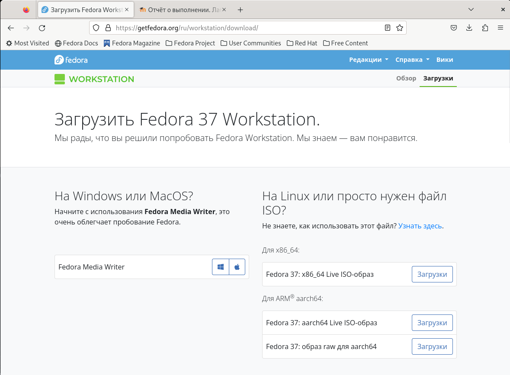

---
## Front matter
lang: ru-RU
title: Лабораторная работа №1
subtitle: Простейший шаблон
author:
  - Атанесов Александр Николаевич 
institute:
  - Российский университет дружбы народов, Москва, Россия
date: 18 февраля 2023

## i18n babel
babel-lang: russian
babel-otherlangs: english

## Formatting pdf
toc: false
toc-title: Содержание
slide_level: 2
aspectratio: 169
section-titles: true
theme: metropolis
header-includes:
 - \metroset{progressbar=frametitle,sectionpage=progressbar,numbering=fraction}
 - '\makeatletter'
 - '\beamer@ignorenonframefalse'
 - '\makeatother'
---

# Информация

## Докладчик

:::::::::::::: {.columns align=center}
::: {.column width="70%"}

  * Атанесов Александр Николаевич 
  * студент группы НБИбд-01-22
  * Российский университет дружбы народов


:::
::::::::::::::

# Вводная часть

## Актуальность

Лабораторная работа актуальна для тех, кто хочет освоить азы устаноки ОС на ВМ.

## Объект и предмет исследования

- Презентация как текст
- Программное обеспечение для создания презентаций
- Входные и выходные форматы презентаций

## Цели и задачи

- Приобрести практические навыки установки ОС на ВМ.

## Материалы и методы

- Процессор `pandoc` для входного формата Markdown
- Результирующие форматы
	- `pdf`
	- `html`
- Автоматизация процесса создания: `Makefile`

# Создание презентации

## Процессор `pandoc`

- Pandoc: преобразователь текстовых файлов
- Сайт: <https://pandoc.org/>
- Репозиторий: <https://github.com/jgm/pandoc>

## Формат `pdf`

- Использование LaTeX
- Пакет для презентации: [beamer](https://ctan.org/pkg/beamer)
- Тема оформления: `metropolis`

## Код для формата `pdf`

```yaml
slide_level: 2
aspectratio: 169
section-titles: true
theme: metropolis
```

## Формат `html`

- Используется фреймворк [reveal.js](https://revealjs.com/)
- Используется [тема](https://revealjs.com/themes/) `beige`

## Код для формата `html`

- Тема задаётся в файле `Makefile`

```make
REVEALJS_THEME = beige 
```
# Результаты

## Получающиеся форматы

- Полученный `pdf`-файл можно демонстрировать в любой программе просмотра `pdf`
- Полученный `html`-файл содержит в себе все ресурсы: изображения, css, скрипты
.

## Содержание исследования

1. Скачивание файла ОС Fedora с ТУИСа. (рис. [-@fig:001])

{#fig:001 width=90%}

##

2. Записываю ISO Fedora на Флешку. (рис. [-@fig:002])

{#fig:002 width=90%}

##

3. Делаю обновления. (рис. [-@fig:003])

{#fig:003 width=90%}

##

4. Установливаю tmux и mc. (рис. [-@fig:004]) 

{#fig:004 width=90%}

##

5. Устанавливаю автообновление. (рис. [-@fig:005])

{#fig:005 width=90%}

##

6. Меняю конфигурацию файла automatic.conf. (рис. [-@fig:006])

{#fig:006 width=90%}

##

7. Устанавливаем Таймер. (рис. [-@fig:007])

{#fig:007 width=90%}

##

8. Снимаю защиту SELINUX. (рис. [-@fig:008])

{#fig:008 width=90%}

##

9. Меняю значение. (рис. [-@fig:009])

{#fig:009 width=90%}

##

10. Перезапускаю. (рис. [-@fig:010])

{#fig:010 width=90%}

##

11. Устанавливаем pandoc. (рис. [-@fig:011])

{#fig:011 width=90%}

##

12. Установка драйверов для Pandoc. (рис. [-@fig:012])

{#fig:012 width=90%}

##

13. Установка texlive. (рис. [-@fig:013])

{#fig:013 width=90%}

##

14. Узнаю версию Linux. (рис. [-@fig:014])

(image/13.png){#fig:014 width=90%}

##

15. Узнаю частоту процессора. (рис. [-@fig:015])

{#fig:015 width=90%}

##

16. Узнаю модель процессорА. (рис. [-@fig:016])

{#fig:016 width=90%}

##

17. Узнаю сколько выделено оперативной памяти (рис. [-@fig:017])

{#fig:017 width=90%}

##

18. Узнаю Тип Файловой СистемЫ Корневого Раздела. (рис. [-@fig:018])

{#fig:018 width=90%}

##

19. Узнаю последовательность монтирования файловых систем. (рис. [-@fig:019])

{#fig:019 width=90%}

##
## Результаты

- Усешно установили Fedora 
- Научились использовать команду dmseg

## Итоговый слайд

- В ходе выполнения лабораторной работы,мы научились устанавливать и настраивать ОС.


