---
## Front matter
title: "Лабораторная работа №4"
subtitle: "Простейший вариант"
author: "Атанесов Александр Николаевич"

## Generic otions
lang: ru-RU
toc-title: "Содержание"

## Bibliography
bibliography: bib/cite.bib
csl: pandoc/csl/gost-r-7-0-5-2008-numeric.csl

## Pdf output format
toc: true # Table of contents
toc-depth: 2
lof: true # List of figures
lot: true # List of tables
fontsize: 12pt
linestretch: 1.5
papersize: a4
documentclass: scrreprt
## I18n polyglossia
polyglossia-lang:
  name: russian
  options:
	- spelling=modern
	- babelshorthands=true
polyglossia-otherlangs:
  name: english
## I18n babel
babel-lang: russian
babel-otherlangs: english
## Fonts
mainfont: PT Serif
romanfont: PT Serif
sansfont: PT Sans
monofont: PT Mono
mainfontoptions: Ligatures=TeX
romanfontoptions: Ligatures=TeX
sansfontoptions: Ligatures=TeX,Scale=MatchLowercase
monofontoptions: Scale=MatchLowercase,Scale=0.9
## Biblatex
biblatex: true
biblio-style: "gost-numeric"
biblatexoptions:
  - parentracker=true
  - backend=biber
  - hyperref=auto
  - language=auto
  - autolang=other*
  - citestyle=gost-numeric
## Pandoc-crossref LaTeX customization
figureTitle: "Рис."
tableTitle: "Таблица"
listingTitle: "Листинг"
lofTitle: "Список иллюстраций"
lotTitle: "Список таблиц"
lolTitle: "Листинги"
## Misc options
indent: true
header-includes:
  - \usepackage{indentfirst}
  - \usepackage{float} # keep figures where there are in the text
  - \floatplacement{figure}{H} # keep figures where there are in the text
---

# Цель работы
Приобретение практических навыков взаимодействия пользователя с системой по-
средством командной строки.

# Задание

 1.Взаимодействрвать с ОС через терминал посредством команд;

# Теоретическое введение

Здесь описываются теоретические аспекты, связанные с выполнением работы.

Например, в табл. [-@tbl:std-dir] приведено краткое описание стандартных каталогов Unix.

: Описание некоторых каталогов файловой системы GNU Linux {#tbl:std-dir}

| Имя каталога | Описание каталога                                                                                                          |
|--------------|----------------------------------------------------------------------------------------------------------------------------|
| `/`          | Корневая директория, содержащая всю файловую                                                                               |
| `/bin `      | Основные системные утилиты, необходимые как в однопользовательском режиме, так и при обычной работе всем пользователям     |
| `/etc`       | Общесистемные конфигурационные файлы и файлы конфигурации установленных программ                                           |
| `/home`      | Содержит домашние директории пользователей, которые, в свою очередь, содержат персональные настройки и данные пользователя |
| `/media`     | Точки монтирования для сменных носителей                                                                                   |
| `/root`      | Домашняя директория пользователя  `root`                                                                                   |
| `/tmp`       | Временные файлы                                                                                                            |
| `/usr`       | Вторичная иерархия для данных пользователя                                                                                 |

Более подробно об Unix см. в [@gnu-doc:bash;@newham:2005:bash;@zarrelli:2017:bash;@robbins:2013:bash;@tannenbaum:arch-pc:ru;@tannenbaum:modern-os:ru].

# Выполнение лабораторной работы

1. Определяю полное имя каталога командой pwd. (рис. [-@fig:001])

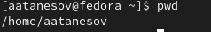{#fig:001 width=90%}

##

2. Открываю каталог tmp. (рис. [-@fig:002])

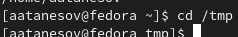{#fig:002 width=90%}

##

3. Вывожу содержимое каталога tmp. (рис. [-@fig:003])

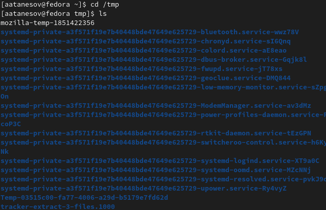{#fig:003 width=90%}

##

4. Вывожу содержимое каталога tmp применив параметр -l. (рис. [-@fig:004]) 

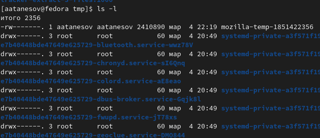{#fig:004 width=90%}

##

5. Пытаюсь определить есть ли cron?. (рис. [-@fig:005])

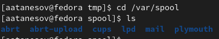{#fig:005 width=90%}

##

6. Определяю владельца домашнего каталога. (рис. [-@fig:006])

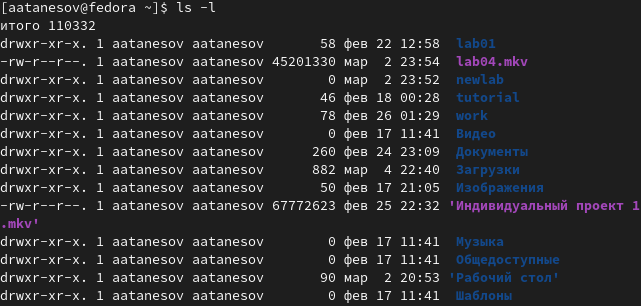{#fig:006 width=90%}

##

7. Создаю каталог newdir. (рис. [-@fig:007])

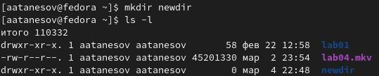{#fig:007 width=90%}

##

8. Открываю newdir  и создаю подкаталог morefun. (рис. [-@fig:008])

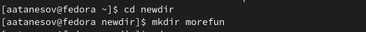{#fig:008 width=90%}

##

9. Возвращаюсь в дом.каталог и создаю три директории одной командой. (рис. [-@fig:009])

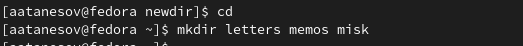{#fig:009 width=90%}

##

10. Удаляю директорию newdir с вложенным morefun. (рис. [-@fig:010])

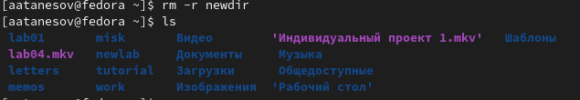{#fig:010 width=90%}

##

11. Определяю набор опций команды ls командой man. (рис. [-@fig:011])

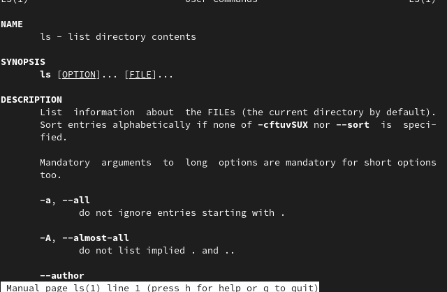{#fig:011 width=90%}

##

12. Использую команду man для просмотра cd. (рис. [-@fig:012])

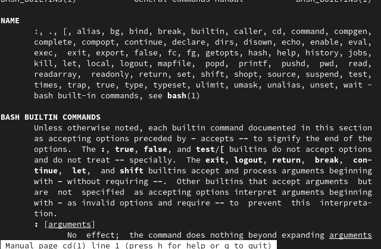{#fig:012 width=90%}

##

13. Использую команду man для просмотра pwd. (рис. [-@fig:013])

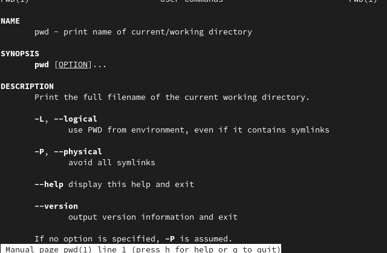{#fig:013 width=90%}

##

14. Использую команду man для просмотра mkdir. (рис. [-@fig:014])

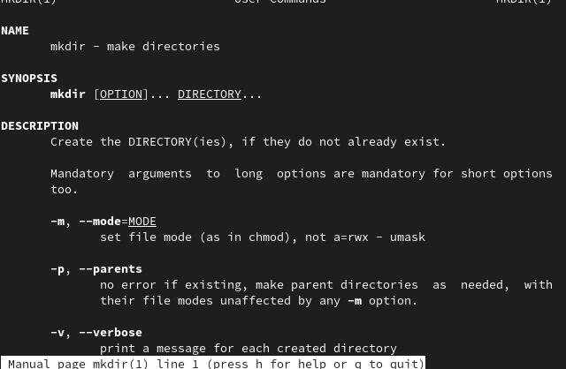(image/13.png){#fig:014 width=90%}

##

15. Использую команду man для просмотра rmdir. (рис. [-@fig:015])

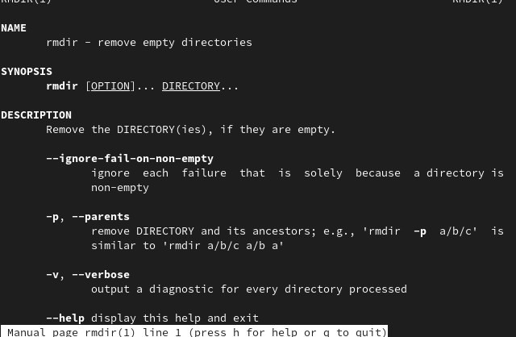{#fig:015 width=90%}

##

16. Использую команду man для просмотра rm. (рис. [-@fig:016])

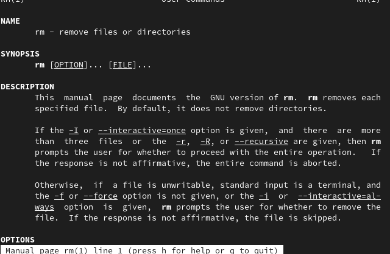{#fig:016 width=90%}

##

17. Проверяю историю введёных мною команд в консоль (рис. [-@fig:017])

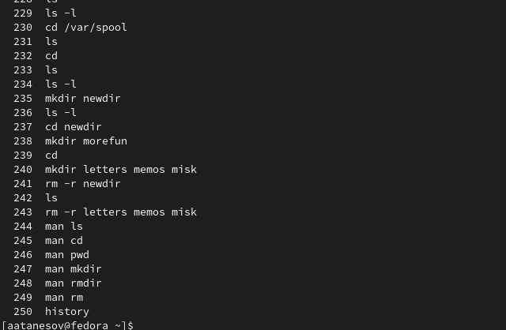{#fig:017 width=90%}

##

# Выводы

- Понял суть используемых мною команд и их параметров

# Ответы на контрольные вопросы

-командная строка - специальная программа, с помощью которой можно управлять компьютером текстовыми командами, вводимыми с клавиатуры
-командой pwd
-командой ls
-ls -all
-для удаление пустого каталога обычно применяют команду rmdir ,а для удвление содержащего в себе какие либо файлы используют rm -r
-history
-<номер_команды>:s/<что_меняем>/<на_что_меняем>
-

# Список литературы{.unnumbered}

::: {#refs}
:::
