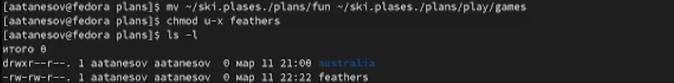

---
## Front matter
title: "Лабораторная работа №5"
subtitle: "Простейший вариант"
author: "Атанесов Александр Николаевич"

## Generic otions
lang: ru-RU
toc-title: "Содержание"

## Bibliography
bibliography: bib/cite.bib
csl: pandoc/csl/gost-r-7-0-5-2008-numeric.csl

## Pdf output format
toc: true # Table of contents
toc-depth: 2
lof: true # List of figures
lot: true # List of tables
fontsize: 12pt
linestretch: 1.5
papersize: a4
documentclass: scrreprt
## I18n polyglossia
polyglossia-lang:
  name: russian
  options:
	- spelling=modern
	- babelshorthands=true
polyglossia-otherlangs:
  name: english
## I18n babel
babel-lang: russian
babel-otherlangs: english
## Fonts
mainfont: PT Serif
romanfont: PT Serif
sansfont: PT Sans
monofont: PT Mono
mainfontoptions: Ligatures=TeX
romanfontoptions: Ligatures=TeX
sansfontoptions: Ligatures=TeX,Scale=MatchLowercase
monofontoptions: Scale=MatchLowercase,Scale=0.9
## Biblatex
biblatex: true
biblio-style: "gost-numeric"
biblatexoptions:
  - parentracker=true
  - backend=biber
  - hyperref=auto
  - language=auto
  - autolang=other*
  - citestyle=gost-numeric
## Pandoc-crossref LaTeX customization
figureTitle: "Рис."
tableTitle: "Таблица"
listingTitle: "Листинг"
lofTitle: "Список иллюстраций"
lotTitle: "Список таблиц"
lolTitle: "Листинги"
## Misc options
indent: true
header-includes:
  - \usepackage{indentfirst}
  - \usepackage{float} # keep figures where there are in the text
  - \floatplacement{figure}{H} # keep figures where there are in the text
---

# Цель работы
Приобретение практических навыков взаимодействия пользователя с системой по-
средством командной строки.

# Задание

 1.Взаимодействрвать с ОС через терминал посредством команд;

# Теоретическое введение

Здесь описываются теоретические аспекты, связанные с выполнением работы.

Например, в табл. [-@tbl:std-dir] приведено краткое описание стандартных каталогов Unix.

: Описание некоторых каталогов файловой системы GNU Linux {#tbl:std-dir}

| Имя каталога | Описание каталога                                                                                                          |
|--------------|----------------------------------------------------------------------------------------------------------------------------|
| `/`          | Корневая директория, содержащая всю файловую                                                                               |
| `/bin `      | Основные системные утилиты, необходимые как в однопользовательском режиме, так и при обычной работе всем пользователям     |
| `/etc`       | Общесистемные конфигурационные файлы и файлы конфигурации установленных программ                                           |
| `/home`      | Содержит домашние директории пользователей, которые, в свою очередь, содержат персональные настройки и данные пользователя |
| `/media`     | Точки монтирования для сменных носителей                                                                                   |
| `/root`      | Домашняя директория пользователя  `root`                                                                                   |
| `/tmp`       | Временные файлы                                                                                                            |
| `/usr`       | Вторичная иерархия для данных пользователя                                                                                 |

Более подробно об Unix см. в [@gnu-doc:bash;@newham:2005:bash;@zarrelli:2017:bash;@robbins:2013:bash;@tannenbaum:arch-pc:ru;@tannenbaum:modern-os:ru].

# Выполнение лабораторной работы

1. Создаю файл abc1. (рис. [-@fig:001])

{#fig:001 width=90%}

##

2. Копирую файл abc1 в april. (рис. [-@fig:002])

{#fig:002 width=90%}

##

3. Копирую abc1 в may. (рис. [-@fig:003])

{#fig:003 width=90%}

##

4. Создаю каталог monthly. (рис. [-@fig:004]) 

{#fig:004 width=90%}

##

5. Копирую aprill may monthly. (рис. [-@fig:005])

{#fig:005 width=90%}

##

6. Копирую monthly.00 в /tmp. (рис. [-@fig:006])

{#fig:006 width=90%}

##

7. Переименовываю april в july (рис. [-@fig:007])

{#fig:007 width=90%}

##

8. Переименовываю july>monthly.00 . (рис. [-@fig:008])

{#fig:008 width=90%}

##

9. Проверяю monthly.00. (рис. [-@fig:009])

{#fig:009 width=90%}

##

10.Переименовываю monthly.00>monthly01. (рис. [-@fig:010])

{#fig:010 width=90%}

##

11. Создаю дирректорию с именем reports. (рис. [-@fig:011])

{#fig:011 width=90%}

##

12. Переношу monthly.01>reports. (рис. [-@fig:012])

{#fig:012 width=90%}

##

13. Переименовываю monthly.01 в monthly. (рис. [-@fig:013])

{#fig:013 width=90%}

##

14. Создаю файл may. (рис. [-@fig:014])

(image/13.png){#fig:014 width=90%}

##

15. Проверяю may. (рис. [-@fig:015])

{#fig:015 width=90%}

##

16. . (рис. [-@fig:016])

{#fig:016 width=90%}(image/18.png){#fig:018 width=90%}

##

17. Проверяю may. (рис. [-@fig:017])

{#fig:017 width=90%}

##

18. Меняю настройки разрешения для файла may. (рис. [-@fig:018])

{#fig:018 width=90%}

##

19. Создаю дирректорию monthly. (рис. [-@fig:019])

{#fig:019 width=90%}

##

20. Создаю файл с именем abc1. (рис. [-@fig:020])

{#fig:020 width=90%}

##

21. Копирую io.h в каталог equipment. (рис. [-@fig:021])

{#fig:021 width=90%}

##

22. Создаю каталог "ski.plases.". (рис. [-@fig:022])

{#fig:022 width=90%}

##

23. Переношу equipment в ski.plases. с новым именем equiplist. (рис. [-@fig:023])

{#fig:023 width=90%}

##

24. Создаю файл touch abc1. (рис. [-@fig:024])

{#fig:024 width=90%}

##

25. Переношу abc1 в ski.p;lases. и мненяю ия на equiplist2. (рис. [-@fig:025])

{#fig:025 width=90%}

##

26. Переношу equiplist2 и equiplist в equipmnent. (рис. [-@fig:026])

{#fig:026 width=90%}

##

27. Создаю директорию newdir и переношу в ski.plans. меняя имя на plans. (рис. [-@fig:027])

{#fig:027 width=90%}

##

28. Создаю директорию australia и меняю разрешения. (рис. [-@fig:028])

{#fig:028 width=90%}

##

29. Меняю разрешения на play и проверяю . (рис. [-@fig:029])

{#fig:029 width=90%}

##

30. Меняю разрешения на my_os и проверяю . (рис. [-@fig:030])

{#fig:030 width=90%}

##

31. Меняю разрешения на feathers и проверяю . (рис. [-@fig:031])

{#fig:031 width=90%}

##

32. Открываю /etc и проверяю . (рис. [-@fig:032])

{#fig:032 width=90%}

##

33. Открываю password. (рис. [-@fig:033])

{#fig:033 width=90%}

##

34. Открываю plans и копирую feathers в file.old. (рис. [-@fig:034])

{#fig:034 width=90%}

##

35. Меняю имя файла fun на games и переношу в каталог play , меняю разрешение на feathers ,а после проверяю . (рис. [-@fig:035])

{#fig:035 width=90%}

##

36. Меняю разрешения на feathers и проверяю . (рис. [-@fig:036])

{#fig:036 width=90%}

##
37. Пробую запустить файл feathers . (рис. [-@fig:037])

{#fig:037 width=90%}

##

38. Просматриваю функционал команды mount . (рис. [-@fig:038])

{#fig:038 width=90%}

##

39. Просматриваю функционал команды fsck . (рис. [-@fig:039])

{#fig:039 width=90%}

##

40. Просматриваю функционал команды mkfs . (рис. [-@fig:040])

{#fig:040 width=90%}

##

41. Просматриваю функционал команды kill . (рис. [-@fig:041])

{#fig:041 width=90%}

# Выводы

- Понял суть используемых мною команд и их параметров

# Ответы на контрольные вопросы

- (1) Ext2: классическая файловая система для Linux, которая является более устаревшей.
- Ext3: новое поколение классической файловой системы Ext2, которая поддерживает журналирование и предоставляет устойчивость в случае непредвиденной ситуации.
- Ext4: самая новая файловая система для Linux, которая создавалась с целью повышения быстродействия и улучшения устойчивости системы.
- Btrfs: относительно новая файловая система, которая предлагает защиту от краха, копирование снимков и улучшенные возможности обнаружения ошибок.
- XFS: файловая система, созданная для обработки больших файловых блоков и является незаменимой для хранения больших файловых баз данных.
- (2)/boot: содержит загрузочные файлы, включая ядро ОС.
- /bin и /sbin: содержат системные утилиты и программы.
- /etc: хранит конфигурационные файлы.
- /home: содержит директории для пользователей.
- /lib и /usr/lib: содержат разделяемые библиотеки для программ.
- /tmp: директория для временных файлов.
- /usr/bin и /usr/sbin: содержат установленные программы.
- /usr/share: содержит общие файлы, такие как документация и изображения.
- /var: содержит изменчивые файлы, например, логи системы.
- (3) Операция монтирования (mount)
- (4) Основные причины нарушения целостности файловой системы в ОС Fedora могут быть связаны с:
1. Неожиданным прерыванием питания или выключением компьютера без предварительного закрытия всех программ и сохранения данных
2. Повреждением диска или других устройств хранения данных
3. Вирусами и другим вредоносным ПО
Чтобы устранить повреждения файловой системы в ОС Fedora, можно выполнить следующие шаги:
1. Запустить инструмент проверки целостности файловой системы (например, fsck) с помощью Live CD
2. Использовать утилиту восстановления GRUB (например, boot-repair) для восстановления загрузчика
3. Использовать команду rpm для переустановки пакетов, связанных с файловой системой
4. Использовать утилиты для восстановления данных (например, TestDisk или photorec) для восстановления поврежденных файлов.
- (5)C помощью команды mkfs
- (6)
- (7)Команда cp в Linux используется для копирования файлов и директорий. Она позволяет копировать один или несколько файлов в один или несколько каталогов, сохранять атрибуты файлов, копировать файлы и директории рекурсивно, с использованием шаблонов, через сеть и т.д. Пример использования: cp file1 dir1/ - копирует файл file1 в каталог dir1.

# Список литературы{.unnumbered}

::: {#refs}
:::
