---
## Front matter
lang: ru-RU
title: Структура научной презентации
subtitle: Лабораторная работа №10
author:
  - Атанесов Алекс.
institute:
  - Российский университет дружбы народов, Москва, Россия
  - RUSSIA, Moscow
date: 15 апреля 2023

## i18n babel
babel-lang: russian
babel-otherlangs: english

## Formatting pdf
toc: false
toc-title: Содержание
slide_level: 2
aspectratio: 169
section-titles: true
theme: metropolis
header-includes:
 - \metroset{progressbar=frametitle,sectionpage=progressbar,numbering=fraction}
 - '\makeatletter'
 - '\beamer@ignorenonframefalse'
 - '\makeatother'
---

# Информация

## Докладчик

:::::::::::::: {.columns align=center}
::: {.column width="70%"}

  * Атанесов Александр Нмиколаевич
  * Студент первого курса
  * Российский университет дружбы народов
  * https://github.com/NEGODAY7484
:::
::: {.column width="30%"}


:::
::::::::::::::


# Создание презентации


1. Изучаю теоретический материал. (рис. [-@fig:001])

{#fig:001 width=90%}

##

2. Изучаю материал о редакторе vi. (рис. [-@fig:002])

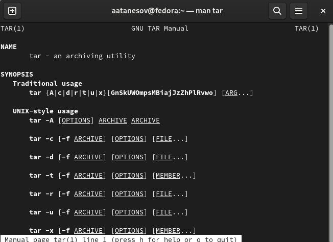{#fig:002 width=90%}

##

3. Создаю каталог os/lab06. (рис. [-@fig:003])

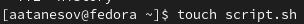{#fig:003 width=90%}

##

4. Открываю lab06. (рис. [-@fig:004]) 

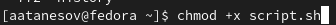{#fig:004 width=90%}

##

5. Создаю и открываю файл через редактор vi. (рис. [-@fig:005])

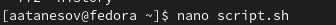{#fig:005 width=90%}

##

6. Использую функцию для вставки текста. (рис. [-@fig:006])

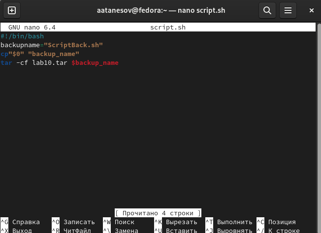{#fig:006 width=90%}

##

7. Вставляю текст, данный в лабораторной работе . (рис. [-@fig:007])

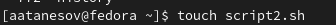{#fig:007 width=90%}

##

8. Выхожу и сохраняю файл . (рис. [-@fig:008])

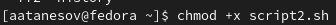{#fig:008 width=90%}

##

9. Делаю файл исполняемым. (рис. [-@fig:009])

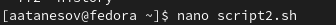{#fig:009 width=90%}

##

10. Вызываю vi редактор. (рис. [-@fig:010])

{#fig:010 width=90%}

##

11. Меняю HELL на HELLO. (рис. [-@fig:011])

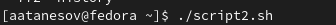{#fig:011 width=90%}

##

12. Cтираю слово LOCAL. (рис. [-@fig:012])

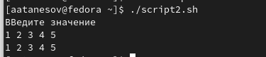{#fig:012 width=90%}

##

13.Пишу вместо него local. (рис. [-@fig:013])

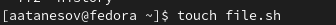{#fig:013 width=90%}

##

14. Перехожу в конец файла и пишу echo $HELLO. (рис. [-@fig:014])

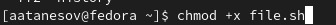{#fig:014 width=90%}

##

15. Отменяю последнюю команду. (рис. [-@fig:015])

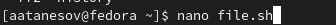{#fig:015 width=90%}

##

16. Сохраняю и выхожу из файла hello.sh. (рис. [-@fig:016])

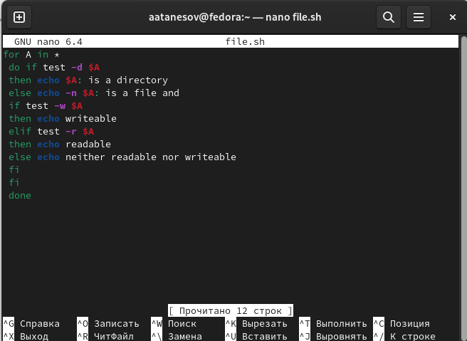{#fig:016 width=90%}

## Процессор `pandoc`

- Pandoc: преобразователь текстовых файлов
- Сайт: <https://pandoc.org/>
- Репозиторий: <https://github.com/jgm/pandoc>

## Формат `pdf`

- Использование LaTeX
- Пакет для презентации: [beamer](https://ctan.org/pkg/beamer)
- Тема оформления: `metropolis`

## Код для формата `pdf`

```yaml
slide_level: 2
aspectratio: 169
section-titles: true
theme: metropolis
```

## Формат `html`

- Используется фреймворк [reveal.js](https://revealjs.com/)
- Используется [тема](https://revealjs.com/themes/) `beige`

## Код для формата `html`

- Тема задаётся в файле `Makefile`

```make
REVEALJS_THEME = beige 
```
# Результаты

## Получающиеся форматы

- Полученный `pdf`-файл можно демонстрировать в любой программе просмотра `pdf`
- Полученный `html`-файл содержит в себе все ресурсы: изображения, css, скрипты

# Элементы презентации

## Актуальность

- Даёт понять, о чём пойдёт речь
- Следует широко и кратко описать проблему
- Мотивировать свое исследование
- Сформулировать цели и задачи
- Возможна формулировка ожидаемых результатов

## Цели и задачи

- Не формулируйте более 1--2 целей исследования

## Материалы и методы

- Представляйте данные качественно
- Количественно, только если крайне необходимо
- Излишние детали не нужны

## Содержание исследования

- Предлагаемое решение задач исследования с обоснованием
- Основные этапы работы

## Результаты

- Не нужны все результаты
- Необходимы логические связки между слайдами
- Необходимо показать понимание материала


## Итоговый слайд

- Запоминается последняя фраза. © Штирлиц
- Главное сообщение, которое вы хотите донести до слушателей
- Избегайте использовать последний слайд вида *Спасибо за внимание*

# Рекомендации

## Принцип 10/20/30

  - 10 слайдов
  - 20 минут на доклад
  - 30 кегль шрифта

## Связь слайдов

::: incremental

- Один слайд --- одна мысль
- Нельзя ссылаться на объекты, находящиеся на предыдущих слайдах (например, на формулы)
- Каждый слайд должен иметь заголовок

:::

## Количество сущностей

::: incremental

- Человек может одновременно помнить $7 \pm 2$ элемента
- При размещении информации на слайде старайтесь чтобы в сумме слайд содержал не более 5 элементов
- Можно группировать элементы так, чтобы визуально было не более 5 групп

:::

## Общие рекомендации

::: incremental

- На слайд выносится та информация, которая без зрительной опоры воспринимается хуже
- Слайды должны дополнять или обобщать содержание выступления или его частей, а не дублировать его
- Информация на слайдах должна быть изложена кратко, чётко и хорошо структурирована
- Слайд не должен быть перегружен графическими изображениями и текстом
- Не злоупотребляйте анимацией и переходами

:::

## Представление данных

::: incremental

- Лучше представить в виде схемы
- Менее оптимально представить в виде рисунка, графика, таблицы
- Текст используется, если все предыдущие способы отображения информации не подошли

:::

