---
## Front matter
title: "Лабораторная работа №10"
subtitle: "Простой способ выполнения лабораторной работы №10"
author: "Атанесов Александр Николаевич"

## Generic otions
lang: ru-RU
toc-title: "Содержание"

## Bibliography
bibliography: bib/cite.bib
csl: pandoc/csl/gost-r-7-0-5-2008-numeric.csl

## Pdf output format
toc: true # Table of contents
toc-depth: 2
lof: true # List of figures
lot: true # List of tables
fontsize: 12pt
linestretch: 1.5
papersize: a4
documentclass: scrreprt
## I18n polyglossia
polyglossia-lang:
  name: russian
  options:
	- spelling=modern
	- babelshorthands=true
polyglossia-otherlangs:
  name: english
## I18n babel
babel-lang: russian
babel-otherlangs: english
## Fonts
mainfont: PT Serif
romanfont: PT Serif
sansfont: PT Sans
monofont: PT Mono
mainfontoptions: Ligatures=TeX
romanfontoptions: Ligatures=TeX
sansfontoptions: Ligatures=TeX,Scale=MatchLowercase
monofontoptions: Scale=MatchLowercase,Scale=0.9
## Biblatex
biblatex: true
biblio-style: "gost-numeric"
biblatexoptions:
  - parentracker=true
  - backend=biber
  - hyperref=auto
  - language=auto
  - autolang=other*
  - citestyle=gost-numeric
## Pandoc-crossref LaTeX customization
figureTitle: "Рис."
tableTitle: "Таблица"
listingTitle: "Листинг"
lofTitle: "Список иллюстраций"
lotTitle: "Список таблиц"
lolTitle: "Листинги"
## Misc options
indent: true
header-includes:
  - \usepackage{indentfirst}
  - \usepackage{float} # keep figures where there are in the text
  - \floatplacement{figure}{H} # keep figures where there are in the text
---

# Цель работы
Изучить основы программирования в оболочке ОС UNIX/Linux. Научиться писать
небольшие командные файлы.

# Задание

 1.Взаимодействрвать с ОС через терминал посредством команд;

# Теоретическое введение

Здесь описываются теоретические аспекты, связанные с выполнением работы.

Например, в табл. [-@tbl:std-dir] приведено краткое описание стандартных каталогов Unix.

: Описание некоторых каталогов файловой системы GNU Linux {#tbl:std-dir}

| Имя каталога | Описание каталога                                                                                                          |
|--------------|----------------------------------------------------------------------------------------------------------------------------|
| `/`          | Корневая директория, содержащая всю файловую                                                                               |
| `/bin `      | Основные системные утилиты, необходимые как в однопользовательском режиме, так и при обычной работе всем пользователям     |
| `/etc`       | Общесистемные конфигурационные файлы и файлы конфигурации установленных программ                                           |
| `/home`      | Содержит домашние директории пользователей, которые, в свою очередь, содержат персональные настройки и данные пользователя |
| `/media`     | Точки монтирования для сменных носителей                                                                                   |
| `/root`      | Домашняя директория пользователя  `root`                                                                                   |
| `/tmp`       | Временные файлы                                                                                                            |
| `/usr`       | Вторичная иерархия для данных пользователя                                                                                 |

Более подробно об Unix см. в [@gnu-doc:bash;@newham:2005:bash;@zarrelli:2017:bash;@robbins:2013:bash;@tannenbaum:arch-pc:ru;@tannenbaum:modern-os:ru].

# Выполнение лабораторной работы

1. Ввожу команду man tar. (рис. [-@fig:001])

{#fig:001 width=90%}

##

2. Изучаю информацию о команде tar. (рис. [-@fig:002])

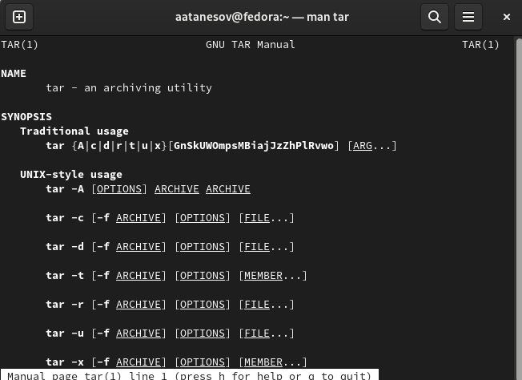{#fig:002 width=90%}

##

3. Создаю файл script.sh. (рис. [-@fig:003])

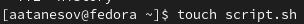{#fig:003 width=90%}

##

4. Делаю файл script.sh исполняемым . (рис. [-@fig:004]) 

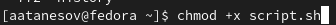{#fig:004 width=90%}

##

5. Открываю файл через nano. (рис. [-@fig:005])

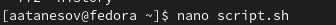{#fig:005 width=90%}

##

6. Ввожу необходимый код ,для выполнения условия. (рис. [-@fig:006])

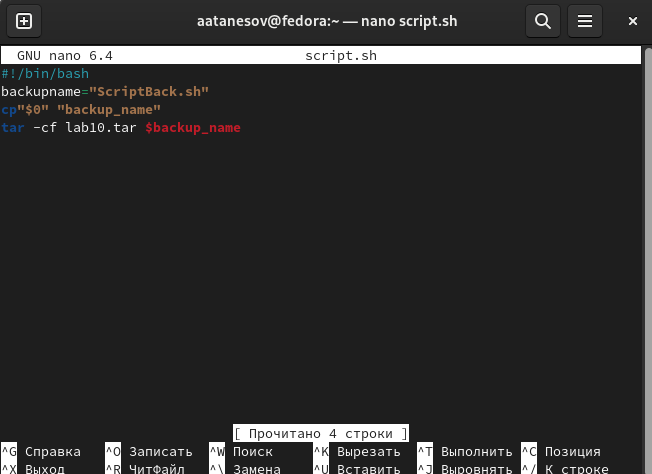{#fig:006 width=90%}

##

7. Создаю файл script2.sh . (рис. [-@fig:007])

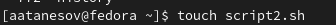{#fig:007 width=90%}

##

8. Делаю файл исполняемым . (рис. [-@fig:008])

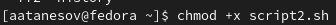{#fig:008 width=90%}

##

9. Открываю файл script2.sh . (рис. [-@fig:009])

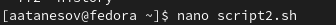{#fig:009 width=90%}

##

10. Ввожу необходимый код. (рис. [-@fig:010])

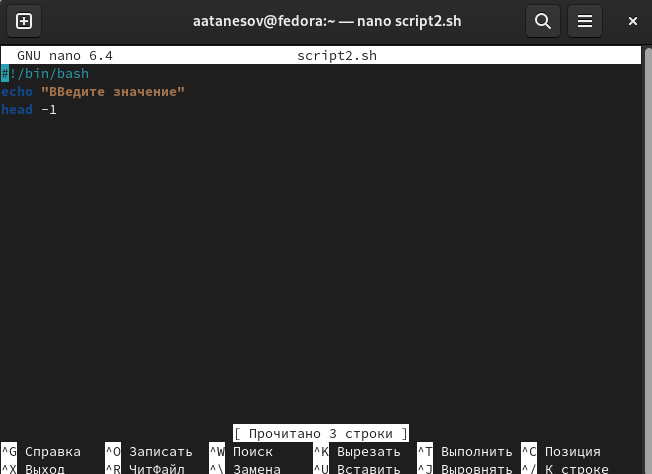{#fig:010 width=90%}

##

11. Выполняю файл script2.sh. (рис. [-@fig:011])

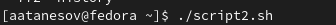{#fig:011 width=90%}

##

12. Смотрю на вывод. (рис. [-@fig:012])

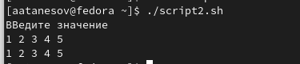{#fig:012 width=90%}

##

13. Создаю файл file.sh. (рис. [-@fig:013])

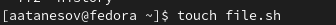{#fig:013 width=90%}

##

14. Делаю файл исполняемым. (рис. [-@fig:014])

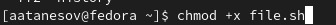(image/13.png){#fig:014 width=90%}

##

15. Открываю файл через nano. (рис. [-@fig:015])

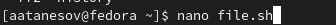{#fig:015 width=90%}

##

16. Ввожу необходимый код. (рис. [-@fig:016])

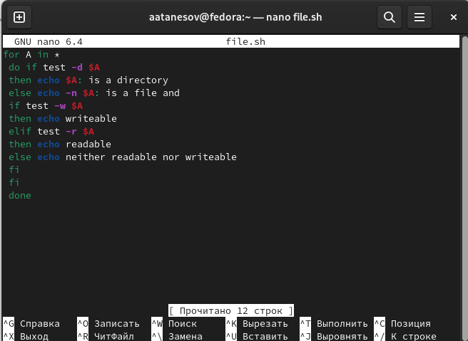{#fig:016 width=90%}(image/18.png){#fig:018 width=90%}

##

17. Воспроизвожу файл file.sh. (рис. [-@fig:017])

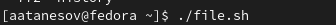{#fig:017 width=90%}

##

18. Смотрю на результат. (рис. [-@fig:018])

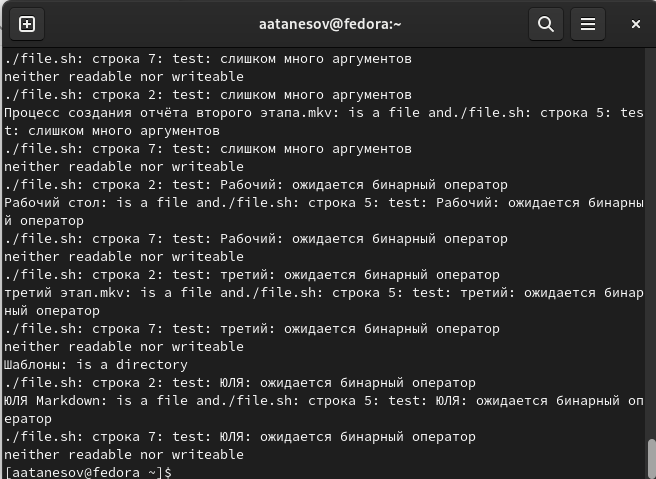{#fig:018 width=90%}

##

19. Создаю файл file2.sh. (рис. [-@fig:019])

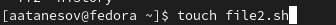{#fig:019 width=90%}

##

20. Делаю файл исполняемым. (рис. [-@fig:020])

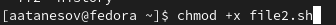{#fig:020 width=90%}

##

21. Запускаю файл через nano. (рис. [-@fig:021])

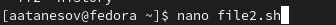{#fig:021 width=90%}

##

22. Ввожу необходимый код. (рис. [-@fig:022])

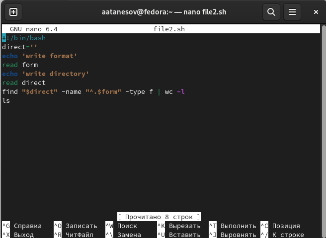{#fig:022 width=90%}

##

23. Воспроизвожу файл file2.sh . (рис. [-@fig:023])

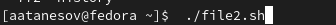{#fig:023 width=90%}

##

24. Смотрю на результат . (рис. [-@fig:024])

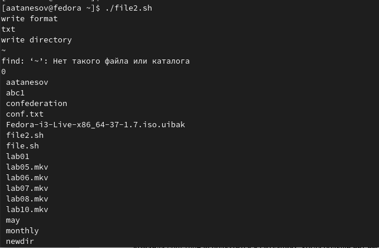{#fig:024 width=90%}

# Выводы

- Познал основы программирования в UNIX.
# Ответы на контрольные вопросы

- 1. Командная оболочка - это программа, которая обеспечивает пользовательский интерфейс для взаимодействия с операционной системой. Она позволяет пользователю вводить команды и запускать программы, а также выполняет подстановку значений переменных и метасимволов. Примеры командных оболочек: bash, zsh, csh, tcsh. Они отличаются синтаксисом и набором доступных функций.

- 2. POSIX (Portable Operating System Interface) - это стандарт, описывающий интерфейс между операционной системой и приложением. Он был разработан для обеспечения переносимости приложений между разными операционными системами и включает в себя спецификации для системных вызовов, библиотек, командных интерпретаторов и других компонентов операционной системы.

- 3. Переменные в языке программирования bash определяются путем присваивания значения имени переменной. Например: var="hello". Массивы определяются с использованием квадратных скобок: array=(1 2 3).

- 4. Оператор let используется для выполнения арифметических операций. Пример: let "var = 2 + 2". Оператор read используется для чтения данных из пользовательского ввода.

- 5. В языке программирования bash можно выполнять арифметические операции сложения, вычитания, умножения, деления, взятия остатка, а также использовать скобки для определения порядка операций.

- 6. Операция (( )) используется для выполнения арифметических операций, а также для сравнения чисел. Например: (( var1 > var2 )). Она возвращает результат в виде 0 (если условие ложно) или 1 (если условие истинно).

- 7. Стандартными именами переменных являются: HOME, USER, PATH, SHELL, TERM и другие. Они определяют различные настройки и параметры системы.

- 8. Метасимволы - это символы, которые используются для обозначения шаблонов и задания нескольких символов в одной команде. Например: *, ?, [], {}.

- 9. Метасимволы можно экранировать, добавив перед ними символ обратного слеша (\). Например: \*.

- 10. Командные файлы создаются с помощью текстового редактора и сохраняются с расширением .sh. Для запуска командного файла необходимо установить ему права на выполнение с помощью команды chmod +x filename.sh, а затем выполнить его с помощью команды ./filename.sh.

- 11. Функции в языке программирования bash определяются с помощью ключевого слова function и блока кода, который должен быть выполнен, когда функция вызывается. Например: function hello { echo "Hello, world!"; }

- 12. Для определения типа файла используется команда file. Например: file myfile.txt. В ответ будет указан тип файла (текстовый, исполняемый и т.д.).

- 13. Команда set используется для установки настроек оболочки, typeset - для определения типа переменных и их свойств, а unset - для удаления переменных.

- 14. В командные файлы параметры передаются через аргументы командной строки. Например: ./script.sh arg1 arg2.

- 15. Специальные переменные языка bash: $0 - имя скрипта, $1, $2 и т.д. - аргументы командной строки, $# - количество переданных параметров, $* и $@ - все аргументы командной строки, $$ - идентификатор текущего процесса, $? - статус завершения последней выполненной команды.

# Список литературы{.unnumbered}

::: {#refs}
:::
