---
## Front matter
title: "Лабораторная работа №11"
subtitle: "Простейший вариант выполнения лабораторной работы
"
author: "Атанесов Александр Николаевич"

## Generic otions
lang: ru-RU
toc-title: "Содержание"

## Bibliography
bibliography: bib/cite.bib
csl: pandoc/csl/gost-r-7-0-5-2008-numeric.csl

## Pdf output format
toc: true # Table of contents
toc-depth: 2
lof: true # List of figures
lot: true # List of tables
fontsize: 12pt
linestretch: 1.5
papersize: a4
documentclass: scrreprt
## I18n polyglossia
polyglossia-lang:
  name: russian
  options:
	- spelling=modern
	- babelshorthands=true
polyglossia-otherlangs:
  name: english
## I18n babel
babel-lang: russian
babel-otherlangs: english
## Fonts
mainfont: PT Serif
romanfont: PT Serif
sansfont: PT Sans
monofont: PT Mono
mainfontoptions: Ligatures=TeX
romanfontoptions: Ligatures=TeX
sansfontoptions: Ligatures=TeX,Scale=MatchLowercase
monofontoptions: Scale=MatchLowercase,Scale=0.9
## Biblatex
biblatex: true
biblio-style: "gost-numeric"
biblatexoptions:
  - parentracker=true
  - backend=biber
  - hyperref=auto
  - language=auto
  - autolang=other*
  - citestyle=gost-numeric
## Pandoc-crossref LaTeX customization
figureTitle: "Рис."
tableTitle: "Таблица"
listingTitle: "Листинг"
lofTitle: "Список иллюстраций"
lotTitle: "Список таблиц"
lolTitle: "Листинги"
## Misc options
indent: true
header-includes:
  - \usepackage{indentfirst}
  - \usepackage{float} # keep figures where there are in the text
  - \floatplacement{figure}{H} # keep figures where there are in the text
---

# Цель работы
Познакомиться с операционной системой Linux. Получить практические навыки работы с редактором vi,
установленным по умолчанию практически во всех дистрибутивах.

# Задание

 1.Взаимодействрвать с редактором vi;

# Теоретическое введение

Здесь описываются теоретические аспекты, связанные с выполнением работы.

Например, в табл. [-@tbl:std-dir] приведено краткое описание стандартных каталогов Unix.

: Описание некоторых каталогов файловой системы GNU Linux {#tbl:std-dir}

| Имя каталога | Описание каталога                                                                                                          |
|--------------|----------------------------------------------------------------------------------------------------------------------------|
| `/`          | Корневая директория, содержащая всю файловую                                                                               |
| `/bin `      | Основные системные утилиты, необходимые как в однопользовательском режиме, так и при обычной работе всем пользователям     |
| `/etc`       | Общесистемные конфигурационные файлы и файлы конфигурации установленных программ                                           |
| `/home`      | Содержит домашние директории пользователей, которые, в свою очередь, содержат персональные настройки и данные пользователя |
| `/media`     | Точки монтирования для сменных носителей                                                                                   |
| `/root`      | Домашняя директория пользователя  `root`                                                                                   |
| `/tmp`       | Временные файлы                                                                                                            |
| `/usr`       | Вторичная иерархия для данных пользователя                                                                                 |

Более подробно об Unix см. в [@gnu-doc:bash;@newham:2005:bash;@zarrelli:2017:bash;@robbins:2013:bash;@tannenbaum:arch-pc:ru;@tannenbaum:modern-os:ru].

# Выполнение лабораторной работы

1. Открываю папку work и создаю lab11.txt. (рис. [-@fig:001])

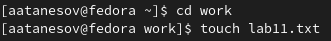{#fig:001 width=90%}

##

2. Открываю lab11.txt. (рис. [-@fig:002])

{#fig:002 width=90%}

##

3. копирую текст песни . (рис. [-@fig:003])

{#fig:003 width=90%}

##

4. Копирую текст в файл lab11.txt. (рис. [-@fig:004]) 

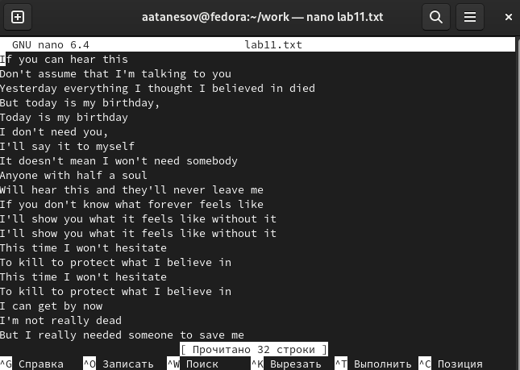{#fig:004 width=90%}

##

5. Создаю файл lab11.sh , делаю его исполняемым и открываю через редактор gedit. (рис. [-@fig:005])

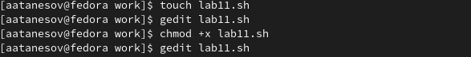{#fig:005 width=90%}

##

6. Пишу код для командного файла. (рис. [-@fig:006])

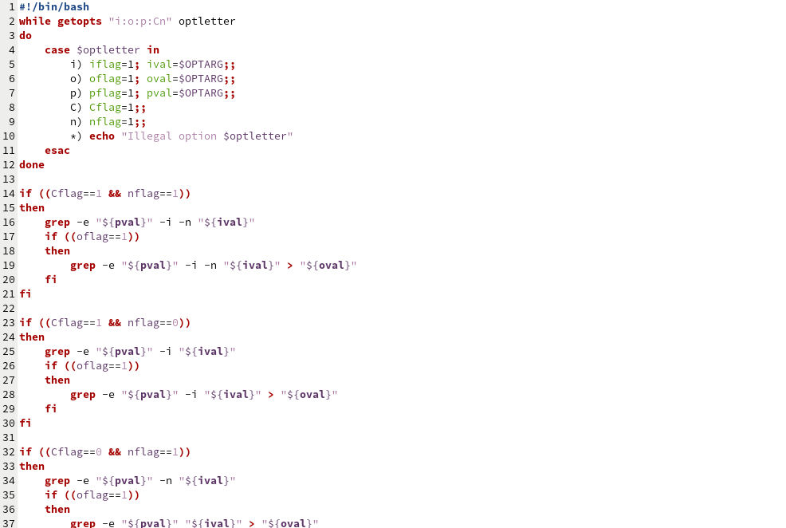{#fig:006 width=90%}

##

7. Вставляю текст, данный в лабораторной работе . (рис. [-@fig:007])

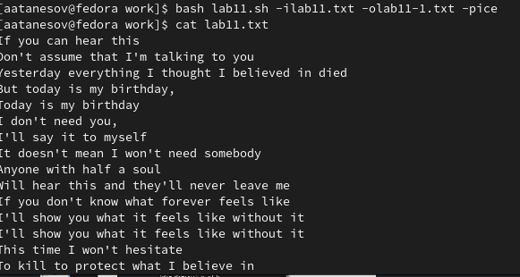{#fig:007 width=90%}

##

8. Компилирую файл и вывожу содержимое файла lab11.txt. (рис. [-@fig:008])

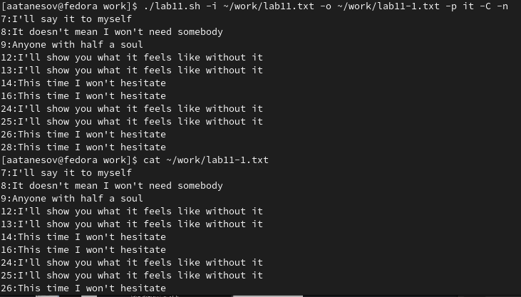{#fig:008 width=90%}

##

9. Вывожу содержимое файла lab11-1.txt. (рис. [-@fig:009])

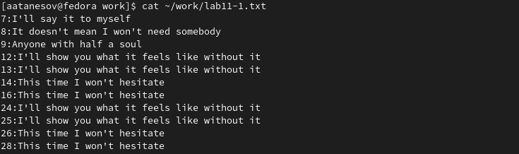{#fig:009 width=90%}

##

10. Воспроизвожу файл lab11-1.txt. (рис. [-@fig:010])

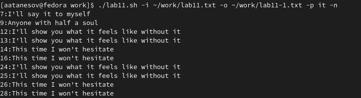{#fig:010 width=90%}

##

11. вывожу содержимое файла lab11.txt. (рис. [-@fig:011])

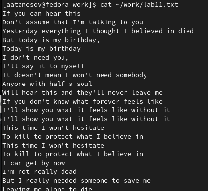{#fig:011 width=90%}

##

12. Создаю файл prog2.c. (рис. [-@fig:012])

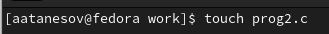{#fig:012 width=90%}

##

13. Открываю файл через gedit. (рис. [-@fig:013])

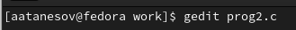{#fig:013 width=90%}

##

14. Пишу код в prog2.c. (рис. [-@fig:014])

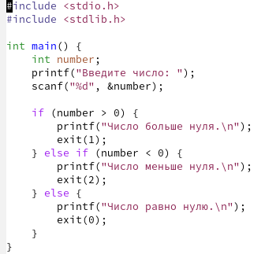{#fig:014 width=90%}

##

15. Создаю prog3.sh. (рис. [-@fig:015])

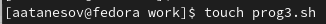{#fig:015 width=90%}

##

16. Открываю файл через gedit. (рис. [-@fig:016])

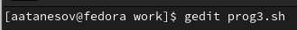{#fig:016 width=90%}

##

17. Пишу код в файле. (рис. [-@fig:017])

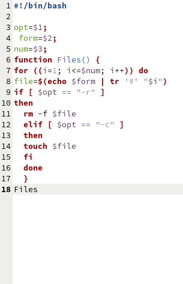{#fig:017 width=90%}

##

18. Создаю файл prog4.sh. (рис. [-@fig:018])

{#fig:018 width=90%}

##

19. Открываю файл prog4.sh. (рис. [-@fig:019])

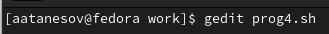{#fig:019 width=90%}

##

20. Пишу код в файле. (рис. [-@fig:020])

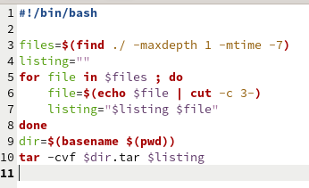{#fig:020 width=90%}

# Выводы

- Узнал о редакторе vi и научился пользоваться его командами.
# Ответы на контрольные вопросы

- 1. Команда getopts используется для обработки опций и аргументов командной строки в скриптах на языках программирования Bash и Shell. Она позволяет удобно и гибко обрабатывать аргументы и опции, заданные пользователем при запуске скрипта.

- 2. Метасимволы используются для генерации имен файлов в командной строке. Например, символ "*" будет заменяться на любое количество символов, тогда как символ "?" заменит один символ. Метасимволы позволяют указывать шаблон имени файла, который будет применен к генерации имен файлов в определенной директории.
- 3. Операторы управления действиями включают в себя if-else, switch-case, for, while, do-while, break, continue и return.

- 4. Операторы для прерывания цикла включают break и continue.

- 5. Команды false и true ничего не делают. Команда false возвращает код ошибки, указывающий на неуспешное выполнение команды, а команда true возвращает код успешного выполнения.

- 6. Строка "if test -f man$s/$i.$s" проверяет, существует ли файл с именем "man$s/$i.$s". Если файл существует, условие истинно и выполняется следующая команда в командном файле.

- 7. Конструкция while выполняет цикл, пока условие истинно, а конструкция until выполняет цикл, пока условие ложно. Другими словами, while выполняет цикл, если условие проверки истинно, а until выполняет цикл, пока условие проверки не является истинным.

# Список литературы{.unnumbered}

::: {#refs}
:::
