---
## Front matter
title: "Лабораторная работа №13"
subtitle: 1032224521
author: "Атанесов Александр Николаевич"

## Generic otions
lang: ru-RU
toc-title: "Содержание"

## Bibliography
bibliography: bib/cite.bib
csl: pandoc/csl/gost-r-7-0-5-2008-numeric.csl

## Pdf output format
toc: true # Table of contents
toc-depth: 2
lof: true # List of figures
lot: true # List of tables
fontsize: 12pt
linestretch: 1.5
papersize: a4
documentclass: scrreprt
## I18n polyglossia
polyglossia-lang:
  name: russian
  options:
	- spelling=modern
	- babelshorthands=true
polyglossia-otherlangs:
  name: english
## I18n babel
babel-lang: russian
babel-otherlangs: english
## Fonts
mainfont: PT Serif
romanfont: PT Serif
sansfont: PT Sans
monofont: PT Mono
mainfontoptions: Ligatures=TeX
romanfontoptions: Ligatures=TeX
sansfontoptions: Ligatures=TeX,Scale=MatchLowercase
monofontoptions: Scale=MatchLowercase,Scale=0.9
## Biblatex
biblatex: true
biblio-style: "gost-numeric"
biblatexoptions:
  - parentracker=true
  - backend=biber
  - hyperref=auto
  - language=auto
  - autolang=other*
  - citestyle=gost-numeric
## Pandoc-crossref LaTeX customization
figureTitle: "Рис."
tableTitle: "Таблица"
listingTitle: "Листинг"
lofTitle: "Список иллюстраций"
lotTitle: "Список таблиц"
lolTitle: "Листинги"
## Misc options
indent: true
header-includes:
  - \usepackage{indentfirst}
  - \usepackage{float} # keep figures where there are in the text
  - \floatplacement{figure}{H} # keep figures where there are in the text
---

# Цель работы
Приобрести простейшие навыки разработки, анализа, тестирования и отладки при-
ложений в ОС типа UNIX/Linux на примере создания на языке программирования
С калькулятора с простейшими функциями.

# Задание

 1. Создать простейший калькулятор в UNIX;

# Выполнение лабораторной работы

1. Создаю папку lab_prog. (рис. [-@fig:001])

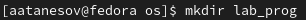{#fig:001 width=90%}

##

2. Создаю файлы calculate.c calculate.h main.c. (рис. [-@fig:002])

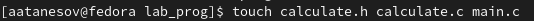{#fig:002 width=90%}

##

3. Делаем эти файлы исполняемыми. (рис. [-@fig:003])

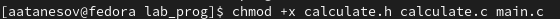{#fig:003 width=90%}

##

4. Открываю файл calculate.c через nano. (рис. [-@fig:004]) 

{#fig:004 width=90%}

##

5. Пишу код для будущего калькулятора. (рис. [-@fig:005])

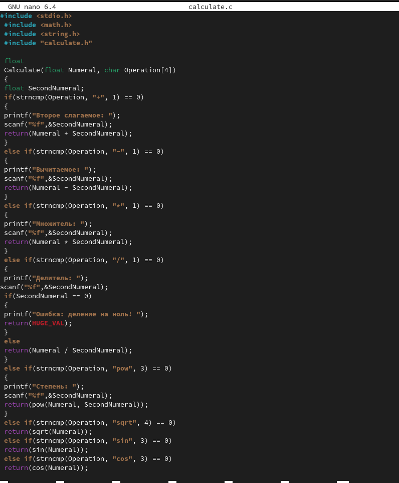{#fig:005 width=90%}

##

6. Открываю файл calculate.h через nano. (рис. [-@fig:006])

{#fig:006 width=90%}

##

7. Пишу необходимый код для calculate.h . (рис. [-@fig:007])

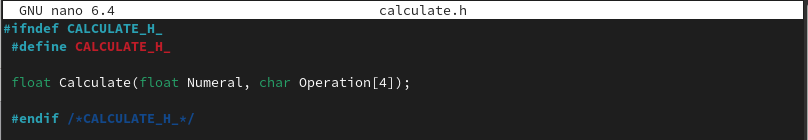{#fig:007 width=90%}

##

8. Открываю файл main.c через nano. (рис. [-@fig:008])

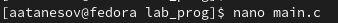{#fig:008 width=90%}

##

9. Пишу необходимый код, представленный в выполнение лабораторной работы №13 . (рис. [-@fig:009])

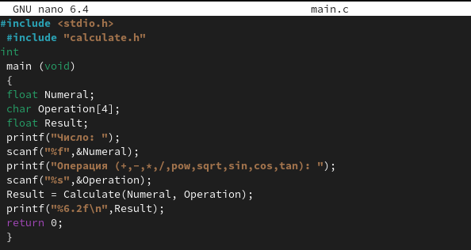{#fig:009 width=90%}

##

10. Создаю файл Makefile. (рис. [-@fig:010])

{#fig:010 width=90%}

##

11. Открываю файл Makefile через nano. (рис. [-@fig:011])

{#fig:011 width=90%}

##

12. Пишу необходимый код. (рис. [-@fig:012])

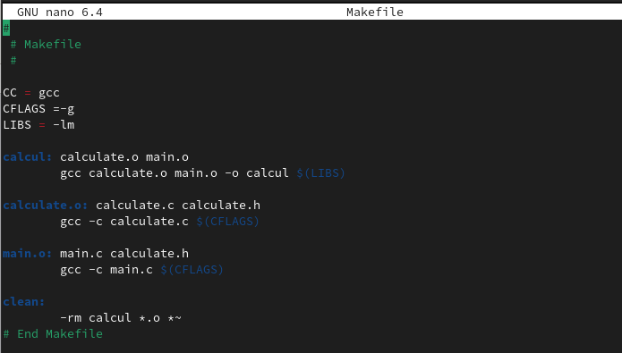{#fig:012 width=90%}

##

13. Запускаю файл калькулятор. (рис. [-@fig:013])

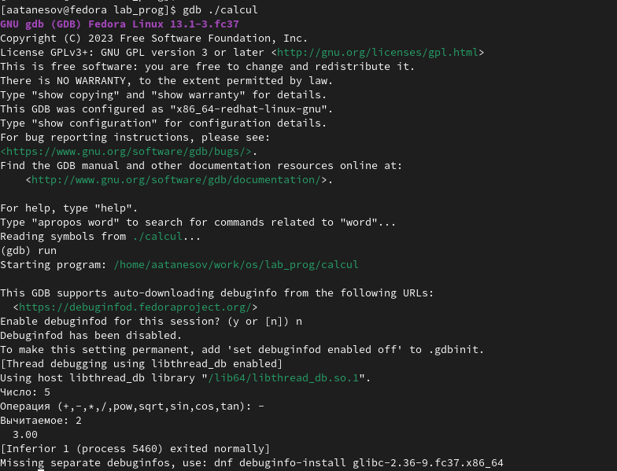{#fig:013 width=90%}

##

14. Вывожу 10 строк кода . (рис. [-@fig:014])

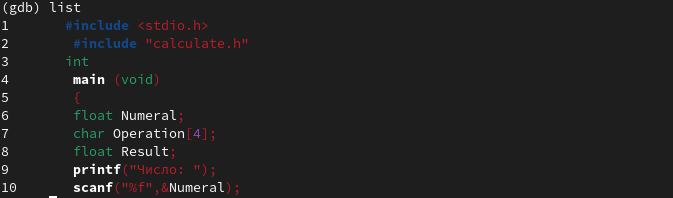(image/13.png){#fig:014 width=90%}

##

15. Вывожу с 12 по 15 строку кода нашей программы. (рис. [-@fig:015])

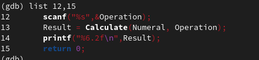{#fig:015 width=90%}

##

16. Вывожу с 20 по 29 строку кода программы. (рис. [-@fig:016])

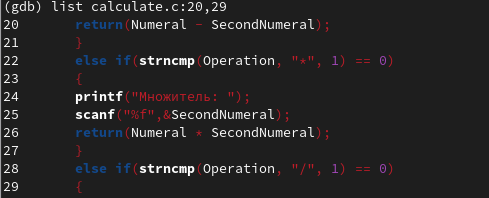{#fig:016 width=90%}(image/18.png){#fig:018 width=90%}

##

17. Вывожу с 20 по 27 и ставлю точку остановки . (рис. [-@fig:017])

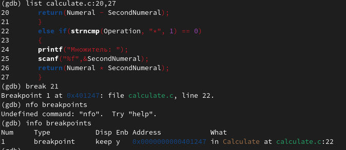{#fig:017 width=90%}

##

18. Вывожу автоматический анализ кода программ main.c и calculate.c . (рис. [-@fig:018])

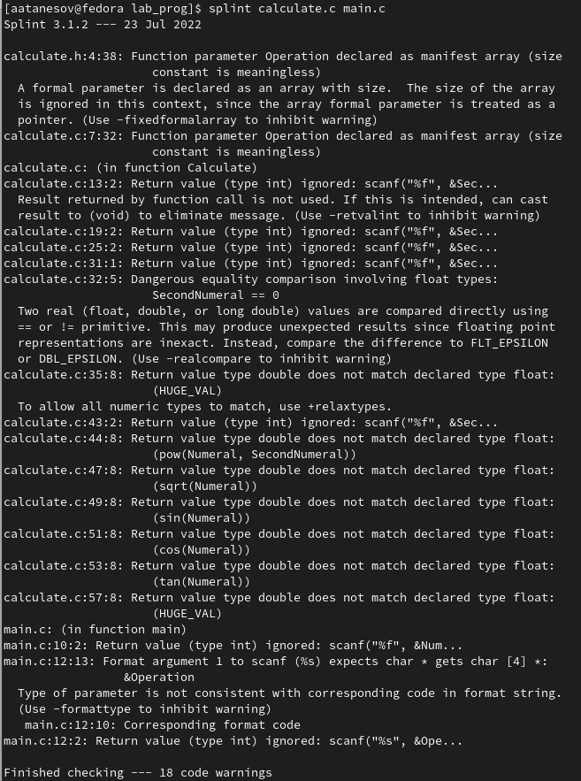{#fig:018 width=90%}


# Выводы

- Я научился создавать простые приложения и открывать их через терминал .

# Пояснение содержимого файла Makefile

- Данный Makefile описывает процесс сборки программы "calcul" из исходных файлов "calculate.c" и "main.c", а также заголовочного файла "calculate.h". 

Переменные CC, CFLAGS и LIBS содержат информацию о компиляторе, флагах компиляции и необходимых для линковки библиотеках соответственно. 

Цель "calcul" (строка 9) зависит от объектных файлов "calculate.o" и "main.o", и собирается командой "gcc calculate.o main.o -o calcul $(LIBS)". 

Цели "calculate.o" и "main.o" (строки 12-16) компилируют соответствующие исходные файлы в объектные файлы. 

Цель "clean" (строка 18) удаляет собранные объектные файлы и исполняемый файл. 

Комментарии на каждой строке поясняют назначение каждой переменной или команды.

# Ответы на контрольные вопросы

- 1. Для получения информации о возможностях программ gcc, make, gdb и др. можно обратиться к их официальной документации, доступной в сети Интернет, а также использовать команду man в терминале UNIX.
- 2. Основными этапами разработки приложений в UNIX являются: проектирование, написание исходного кода, компиляция, отладка, тестирование, установка и настройка приложения.
- 3. Суффикс в контексте языка программирования - это часть названия файла, указывающая на его тип и формат. Например, файл со суффиксом ".c" обозначает исходный код на языке С, а файл со суффиксом ".o" - скомпилированный объектный файл.
- 4. Основное назначение компилятора языка С в UNIX - это компиляция исходного кода на этом языке в машинный код, который может быть выполнен на компьютере.
- 5. Утилита make предназначена для автоматизации процесса сборки приложения из исходного кода и скомпилированных объектных файлов.
- 6. Пример структуры Makefile:

```
TARGET = my_program
CC = gcc
CFLAGS = -Wall -O2

$(TARGET): main.o functions.o
        $(CC) -o $(TARGET) main.o functions.o

main.o: main.c functions.h
        $(CC) $(CFLAGS) -c main.c

functions.o: functions.c functions.h
        $(CC) $(CFLAGS) -c functions.c
```

- Основные элементы Makefile:

- TARGET - имя целевого файла приложения;
- CC - имя компилятора;
- CFLAGS - опции компилятора;
- $(TARGET), $(CC), $(CFLAGS) - переменные, значения которых используются в правилах Makefile;
- $(TARGET): main.o functions.o - правило сборки, которое указывает, что для создания целевого файла $(TARGET) необходимы объектные файлы main.o и functions.o;
- main.o, functions.o - зависимости, т.е. файлы, которые необходимы для создания других файлов;
- main.c, functions.c, functions.h - исходные файлы приложения;
- $(CC) -o $(TARGET) main.o functions.o - команда сборки, которая говорит компилятору собрать файл $(TARGET) из - - объектных файлов main.o и functions.o;
- $(CC) $(CFLAGS) -c main.c - команда компиляции исходного файла main.c в объектный файл main.o с опциями $(CFLAGS).

- 7. Основное свойство, присущее всем программам отладки - это возможность управления выполнением программы, т.е. - пошаговой отладки. Для использования этого свойства необходимо установить точки останова в программе и запустить - ее в режиме отладки.
- 8. Основные команды отладчика gdb: 

- run - запустить программу;
- break - установить точку останова в коде программы;
- next - выполнить следующую строку кода и остановиться;
- step - выполнить следующую строку кода и зайти в подпрограмму, если она вызывается в этой строке;
- print - вывести значение переменной;
- watch - установить точку останова на изменение значения переменной.

- 9. Схема отладки программы:

- 1. Компилирование программы с опцией -g, которая добавляет отладочную информацию к скомпилированному файлу.
- 2. Запуск gdb с указанием имени скомпилированного файла.
- 3. Установка точек останова в нужных местах с помощью команды break.
- 4. Запуск программы с помощью команды run.
- 5. Пошаговое выполнение программы с помощью команд next или step.
- 6. Использование команды print для вывода значений переменных или выражений.
- 7. Остановка выполнения программы с помощью команды break, если необходимо.
- 8. Выход из gdb с помощью команды quit.

- 10. Компилятор при первом запуске анализирует синтаксическую корректность исходного кода программы и выдает сообщения об ошибках, если они есть. Эти сообщения содержат информацию о месте ошибки и ее характере. Размер и сложность программы также могут влиять на время компиляции.
- 11. Основные средства, повышающие понимание исходного кода программы - это комментарии в коде, описания функций и переменных, документация к проекту, а также использование среды разработки, которая облегчает чтение и изменение кода.
- 12. Основные задачи, решаемые программой splint - это статический анализ исходного кода на языке С с целью выявления потенциальных ошибок, утечки памяти и других проблем, связанных с безопасностью, надежностью и качеством кода.

# Список литературы{.unnumbered}

::: {#refs}
:::
