---
## Front matter
lang: ru-RU
title: Структура презентации четвёртого этапа 
subtitle: Всё просто
author:
  - Атанесов Алекс
institute:
  - Российский университет дружбы народов, Москва, Россия
  - Jan Watan Turkmenistan!
date: 28 апреля 2023

## i18n babel
babel-lang: russian
babel-otherlangs: english

## Formatting pdf
toc: false
toc-title: Содержание
slide_level: 2
aspectratio: 169
section-titles: true
theme: metropolis
header-includes:
 - \metroset{progressbar=frametitle,sectionpage=progressbar,numbering=fraction}
 - '\makeatletter'
 - '\beamer@ignorenonframefalse'
 - '\makeatother'
---

# Информация

## Докладчик

:::::::::::::: {.columns align=center}
::: {.column width="70%"}

  * Атанесов Александр Николаевич
  * начинающий профессор студент НбИ
  * <https://github.com/NEGODAY7484>

:::
::: {.column width="30%"}


:::
::::::::::::::

# Вводная часть

## Актуальность

- Важно донести результаты своих исследований до окружающих
- Научная презентация --- рабочий инструмент исследователя
- Необходимо создавать презентацию быстро
- Желательна минимизация усилий для создания презентации

## Объект и предмет исследования

- Презентация как текст
- Программное обеспечение для создания презентаций
- Входные и выходные форматы презентаций

## Цели и задачи

- Создать шаблон презентации в Markdown
- Описать алгоритм создания выходных форматов презентаций

## Материалы и методы

- Процессор `pandoc` для входного формата Markdown
- Результирующие форматы
	- `pdf`
	- `html`
- Автоматизация процесса создания: `Makefile`

# Создание презентации

## Процессор `pandoc`

- Pandoc: преобразователь текстовых файлов
- Сайт: <https://pandoc.org/>
- Репозиторий: <https://github.com/jgm/pandoc>

## Формат `pdf`

- Использование LaTeX
- Пакет для презентации: [beamer](https://ctan.org/pkg/beamer)
- Тема оформления: `metropolis`

## Код для формата `pdf`

```yaml
slide_level: 2
aspectratio: 169
section-titles: true
theme: metropolis
```

## Формат `html`

- Используется фреймворк [reveal.js](https://revealjs.com/)
- Используется [тема](https://revealjs.com/themes/) `beige`

## Код для формата `html`

- Тема задаётся в файле `Makefile`

```make
REVEALJS_THEME = beige 
```
# Результаты

## Получающиеся форматы

- Полученный `pdf`-файл можно демонстрировать в любой программе просмотра `pdf`
- Полученный `html`-файл содержит в себе все ресурсы: изображения, css, скрипты

# Элементы презентации

# Цель работы

- Добавить ссылки на ресурсы
- Добавить пост о прошедшей неделе 
- Добавить пост на тему по выбору

# Задание

Написать два поста.

# Выполнение лабораторной работы

1. Открываю 4-ый этап в ТУИСе и регистрируюсь по ссылкам. (рис. [-@fig:001])

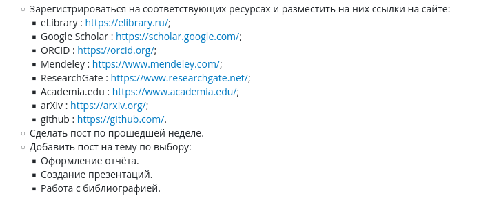{#fig:001 width=90%}

##

2. Копирую ссылку с eLIBRARY. (рис. [-@fig:002])

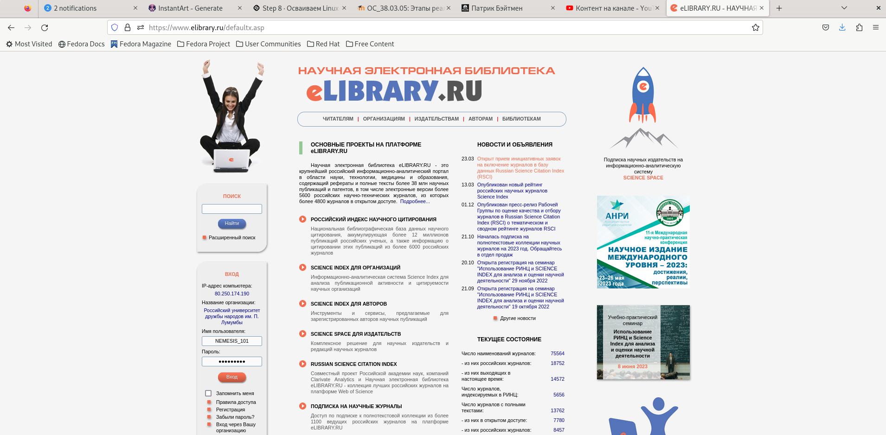{#fig:002 width=90%}

##

3. Копирую ссылку с Google Академия. (рис. [-@fig:003])

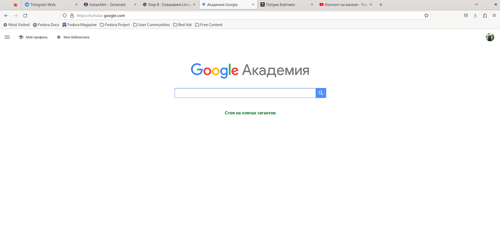{#fig:003 width=90%}

##

4. Копирую ссылку с Github. (рис. [-@fig:004]) 

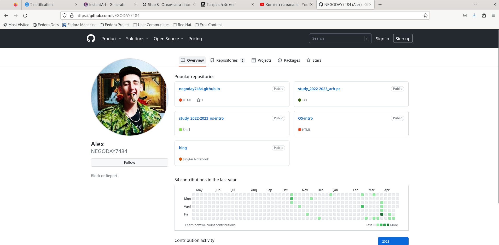{#fig:004 width=90%}

##

5. Открываю файл index.md в папке admin. (рис. [-@fig:005])

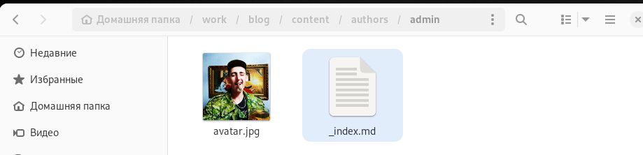{#fig:005 width=90%}

##

6. Добавляю ссылки в файле. (рис. [-@fig:006])

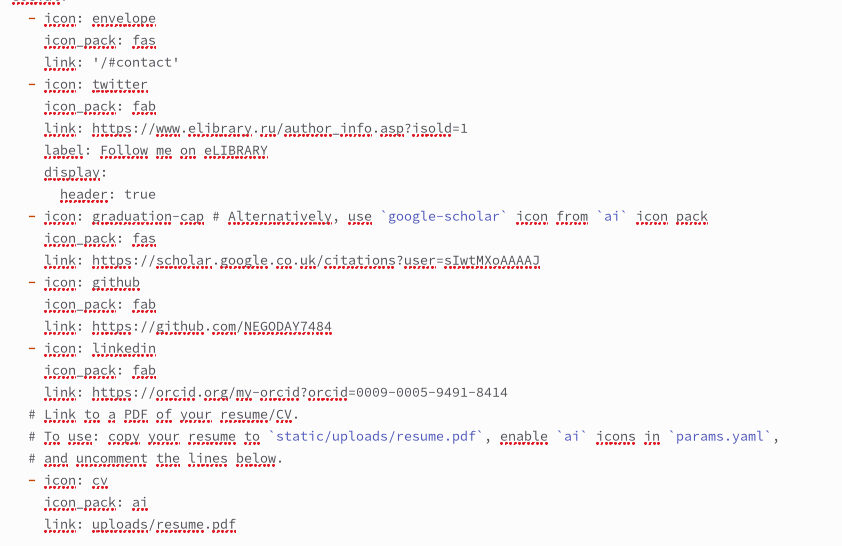{#fig:006 width=90%}

##

7. Открываю папку Posts и копирую папку с новым именем John Week). (рис. [-@fig:007])

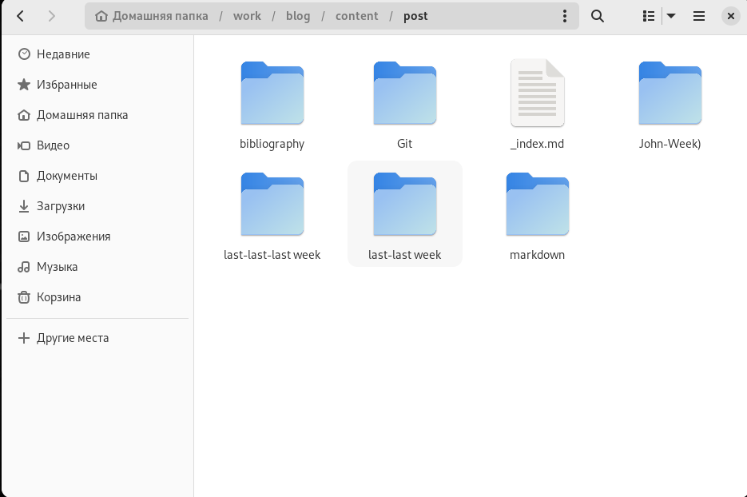{#fig:007 width=90%}

##

8.  Меняю изображение и открываю файл index.md . (рис. [-@fig:008])

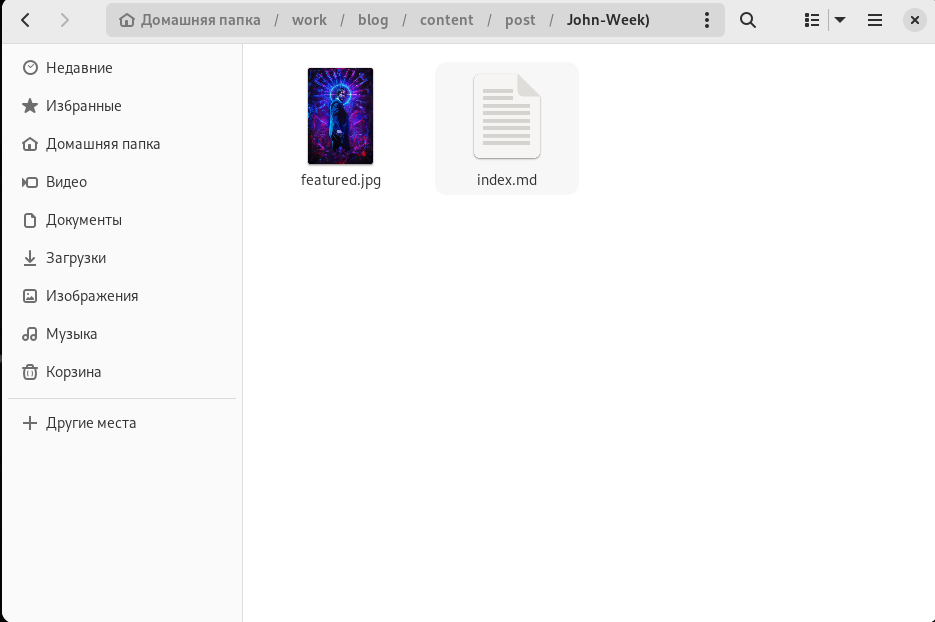{#fig:008 width=90%}

##

9. пишу пост о прошедшей неделе и сохраняю файл. (рис. [-@fig:009])

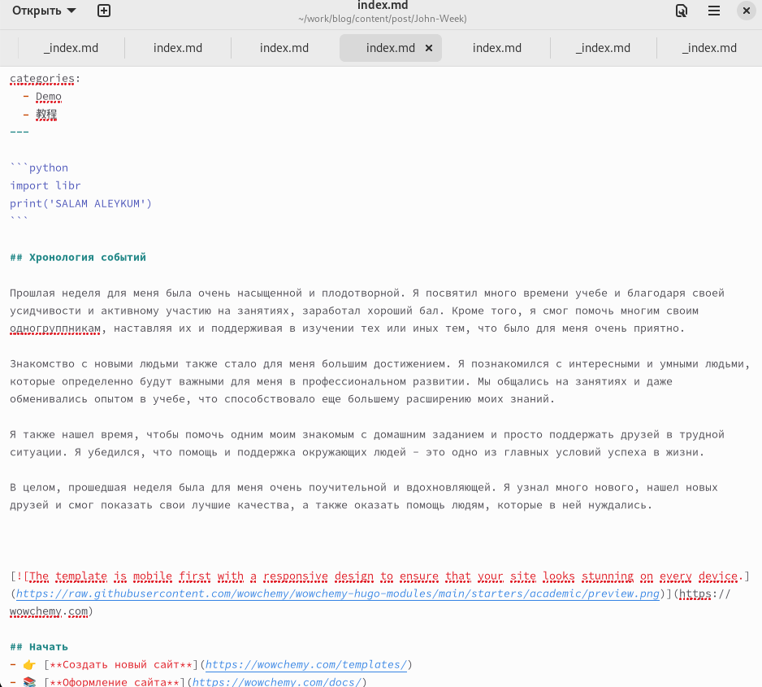{#fig:009 width=90%}

##

10. Открываю только что созданную папку bibliography , в которой я меняю изображение и открываю файл inddex.md  . (рис. [-@fig:010])

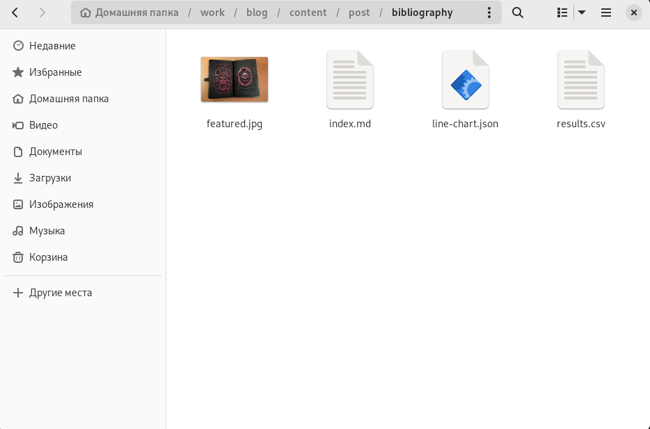{#fig:010 width=90%}

##

11. Открываю файл index.md и пишу пост о Библиографии. (рис. [-@fig:011])

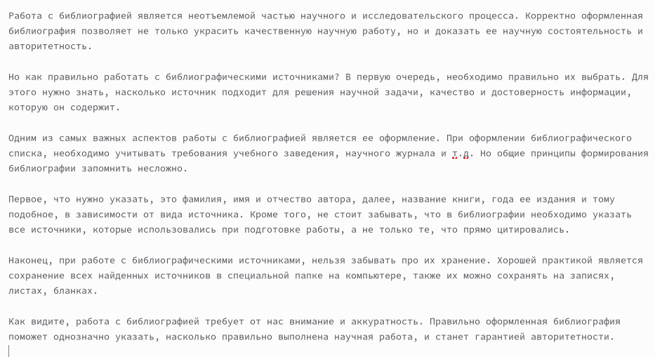{#fig:011 width=90%}

##

12. Смотрю на результат. (рис. [-@fig:012])

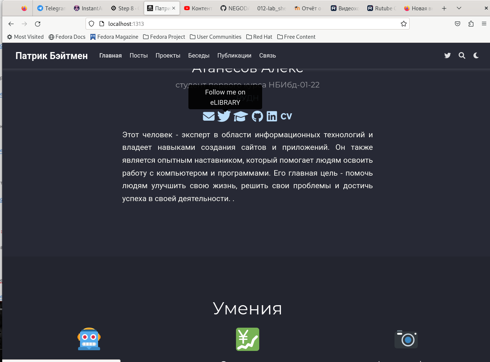{#fig:012 width=90%}

##

13. Смотрю на результат. (рис. [-@fig:013])

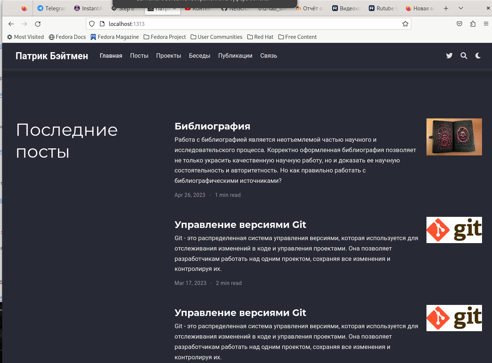{#fig:013 width=90%}

##

14. Смотрю на результат. (рис. [-@fig:014])

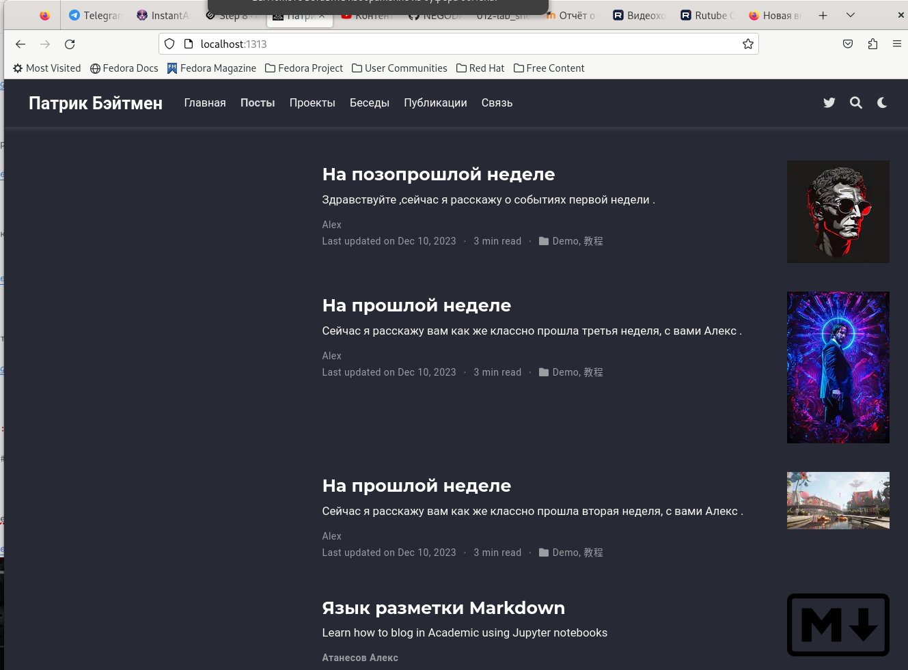{#fig:014 width=90%}

# Выводы

Я научился изменять информацию шаблона сайта github.io.

## Представление данных

::: incremental

- Лучше представить в виде схемы
- Менее оптимально представить в виде рисунка, графика, таблицы
- Текст используется, если все предыдущие способы отображения информации не подошли

:::

