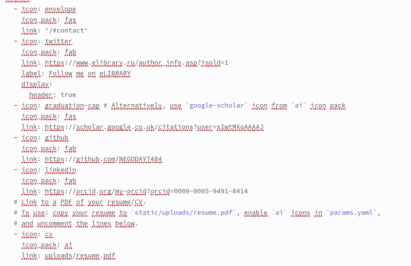

---
## Front matter
title: "Четвёртый этап индивидуального проекта"
subtitle: "Наипростеший вариант выполнения"
author: "Атанесов Александр"

## Generic otions
lang: ru-RU
toc-title: "Содержание"

## Bibliography
bibliography: bib/cite.bib
csl: pandoc/csl/gost-r-7-0-5-2008-numeric.csl

## Pdf output format
toc: true # Table of contents
toc-depth: 2
lof: true # List of figures
lot: true # List of tables
fontsize: 12pt
linestretch: 1.5
papersize: a4
documentclass: scrreprt
## I18n polyglossia
polyglossia-lang:
  name: russian
  options:
	- spelling=modern
	- babelshorthands=true
polyglossia-otherlangs:
  name: english
## I18n babel
babel-lang: russian
babel-otherlangs: english
## Fonts
mainfont: PT Serif
romanfont: PT Serif
sansfont: PT Sans
monofont: PT Mono
mainfontoptions: Ligatures=TeX
romanfontoptions: Ligatures=TeX
sansfontoptions: Ligatures=TeX,Scale=MatchLowercase
monofontoptions: Scale=MatchLowercase,Scale=0.9
## Biblatex
biblatex: true
biblio-style: "gost-numeric"
biblatexoptions:
  - parentracker=true
  - backend=biber
  - hyperref=auto
  - language=auto
  - autolang=other*
  - citestyle=gost-numeric
## Pandoc-crossref LaTeX customization
figureTitle: "Рис."
tableTitle: "Таблица"
listingTitle: "Листинг"
lofTitle: "Список иллюстраций"
lotTitle: "Список таблиц"
lolTitle: "Листинги"
## Misc options
indent: true
header-includes:
  - \usepackage{indentfirst}
  - \usepackage{float} # keep figures where there are in the text
  - \floatplacement{figure}{H} # keep figures where there are in the text
---

# Цель работы

- Добавить ссылки на ресурсы
- Добавить пост о прошедшей неделе 
- Добавить пост на тему по выбору

# Задание

Написать два поста.

# Выполнение лабораторной работы

1. Открываю 4-ый этап в ТУИСе и регистрируюсь по ссылкам. (рис. [-@fig:001])

{#fig:001 width=90%}

##

2. Копирую ссылку с eLIBRARY. (рис. [-@fig:002])

{#fig:002 width=90%}

##

3. Копирую ссылку с Google Академия. (рис. [-@fig:003])

{#fig:003 width=90%}

##

4. Копирую ссылку с Github. (рис. [-@fig:004]) 

{#fig:004 width=90%}

##

5. Открываю файл index.md в папке admin. (рис. [-@fig:005])

{#fig:005 width=90%}

##

6. Добавляю ссылки в файле. (рис. [-@fig:006])

{#fig:006 width=90%}

##

7. Открываю папку Posts и копирую папку с новым именем John Week). (рис. [-@fig:007])

{#fig:007 width=90%}

##

8.  Меняю изображение и открываю файл index.md . (рис. [-@fig:008])

{#fig:008 width=90%}

##

9. пишу пост о прошедшей неделе и сохраняю файл. (рис. [-@fig:009])

{#fig:009 width=90%}

##

10. Открываю только что созданную папку bibliography , в которой я меняю изображение и открываю файл inddex.md  . (рис. [-@fig:010])

{#fig:010 width=90%}

##

11. Открываю файл index.md и пишу пост о Библиографии. (рис. [-@fig:011])

{#fig:011 width=90%}

##

12. Смотрю на результат. (рис. [-@fig:012])

{#fig:012 width=90%}

##

13. Смотрю на результат. (рис. [-@fig:013])

{#fig:013 width=90%}

##

14. Смотрю на результат. (рис. [-@fig:014])

{#fig:014 width=90%}

# Выводы

Я научился изменять информацию шаблона сайта github.io.

# Список литературы{.unnumbered}

::: {#refs}
:::
