---
## Front matter
lang: ru-RU
title: Презентация пятого этапа 
subtitle: 1032224521
author:
  - Атанесов Александр
institute:
  - Российский университет дружбы народов, Москва, Россия
date: 5 мая 2023

## i18n babel
babel-lang: russian
babel-otherlangs: english

## Formatting pdf
toc: false
toc-title: Содержание
slide_level: 2
aspectratio: 169
section-titles: true
theme: metropolis
header-includes:
 - \metroset{progressbar=frametitle,sectionpage=progressbar,numbering=fraction}
 - '\makeatletter'
 - '\beamer@ignorenonframefalse'
 - '\makeatother'
---

# Информация

## Докладчик

:::::::::::::: {.columns align=center}
::: {.column width="70%"}

  * Атанесов Александр Николаевич
  * Студент первого курса, гений
  * Российский университет дружбы народов
  * [https://negoday7484.github.io/]
  * <https://github.com/NEGODAY7484>

:::
::: {.column width="30%"}

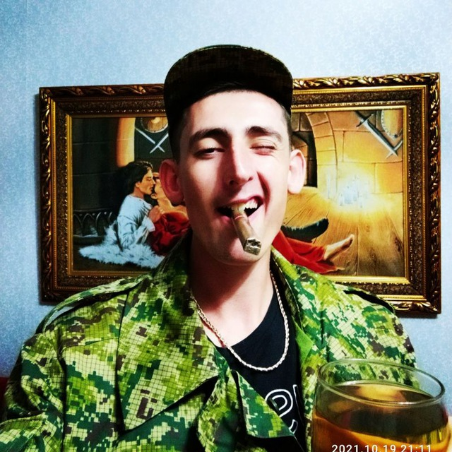

:::
::::::::::::::

# Цель работы

- Сделать записи для персональных проектов.
- Сделать пост по прошедшей неделе.
- Добавить пост на тему по выбору.
-  Языки научного программирования.
# Задание

Написать два поста :про прошлую неделю и про языки научного программирования.

# Выполнение пятого этапа индивидуального проекта

1. Запускаю hugo server в папке blog. (рис. [-@fig:001])

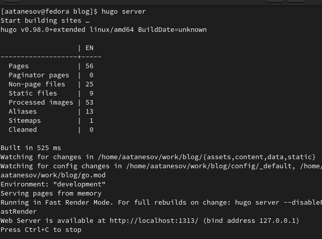{#fig:001 width=90%}

##

2. Открываю ссылку localhost. (рис. [-@fig:002])

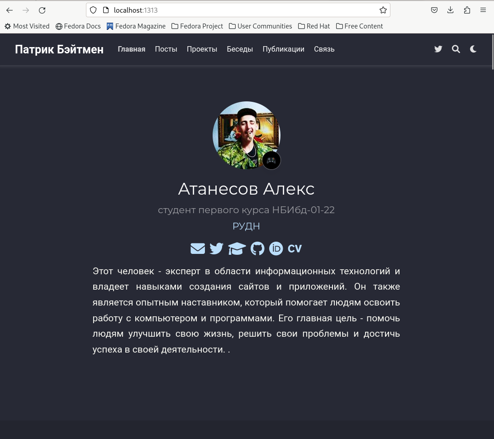{#fig:002 width=90%}

##

3. Верстаю страницу до нужного мне этапа Projects. (рис. [-@fig:003])

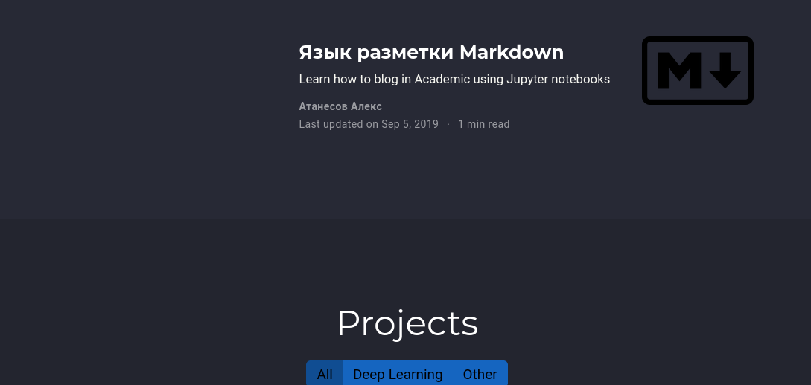{#fig:003 width=90%}

##

4. Перехожу в .../work/blog/content/project/example , меняю изображение и открываю index.md. (рис. [-@fig:004]) 

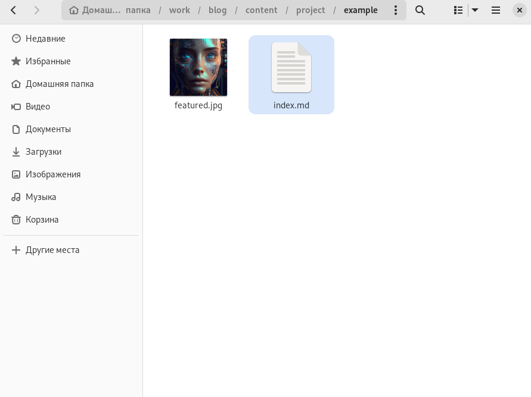{#fig:004 width=90%}

##

5. Пишу пост о проекте "Живое железо". (рис. [-@fig:005])

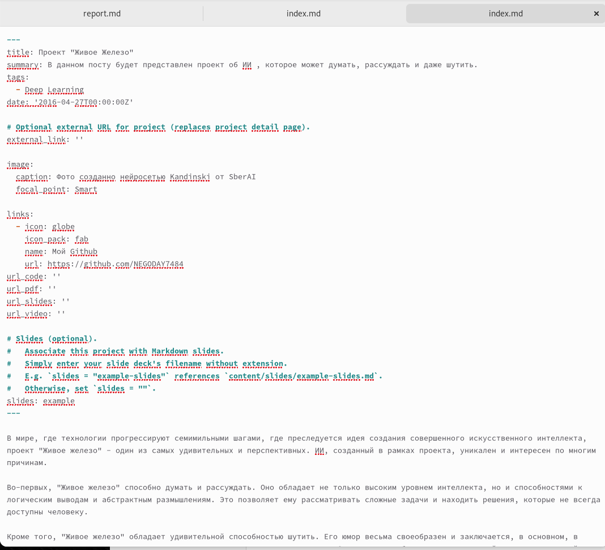{#fig:005 width=90%}

##

6. Проверяю изменения на локальном сайте. (рис. [-@fig:006])

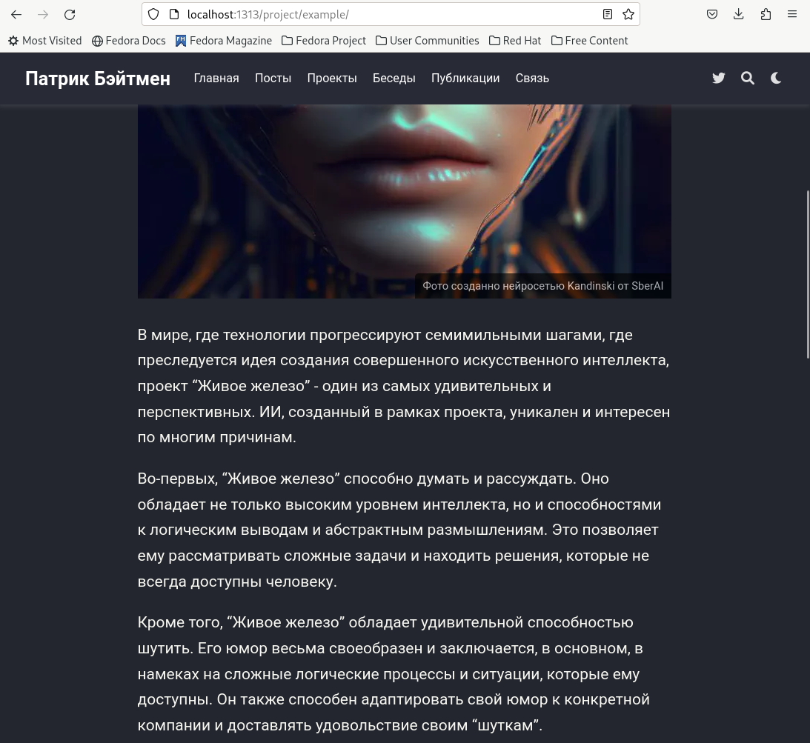{#fig:006 width=90%}

##

7. Перехожу в .../work/blog/content/project/Solar Roadways , меняю изображение и открываю index.md. (рис. [-@fig:007])

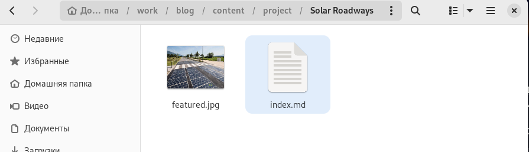{#fig:007 width=90%}

##

8.  Пишу пост о проекте "Солнечные дороги" . (рис. [-@fig:008])

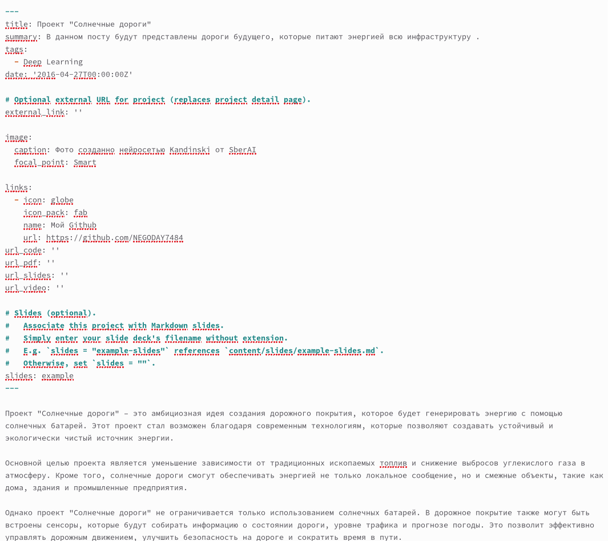{#fig:008 width=90%}

##

9.  Проверяю изменения на локальном сайте. (рис. [-@fig:009])

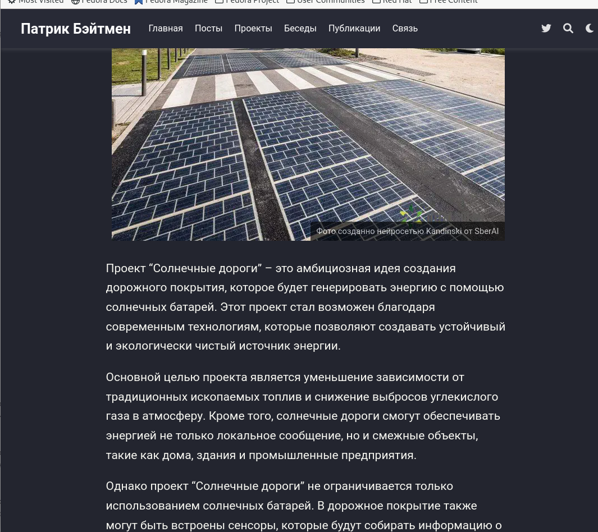{#fig:009 width=90%}

##

10. Перехожу в .../work/blog/content/post/The Science , меняю изображение и открываю index.md  . (рис. [-@fig:010])

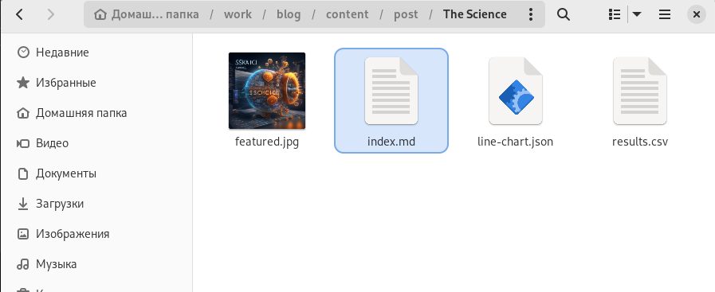{#fig:010 width=90%}

##

11. Открыв файл index.md и пишу пост о Языках Научного программирования. (рис. [-@fig:011])

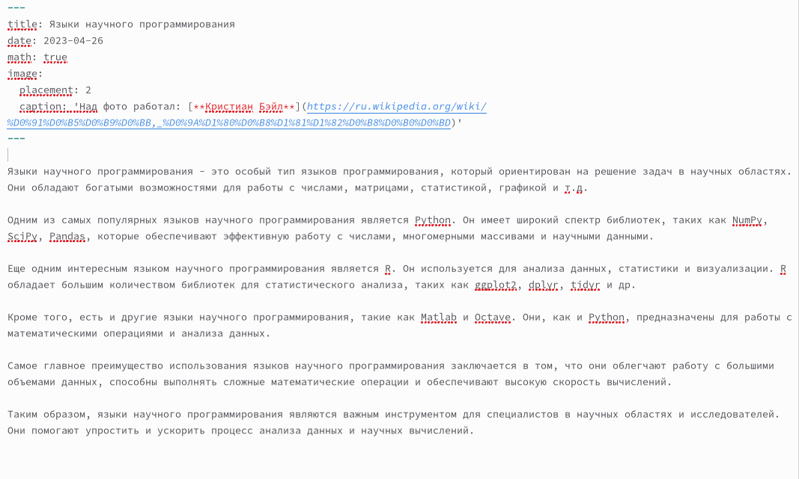{#fig:011 width=90%}

##

12.  Проверяю изменения на локальном сайте. (рис. [-@fig:012])

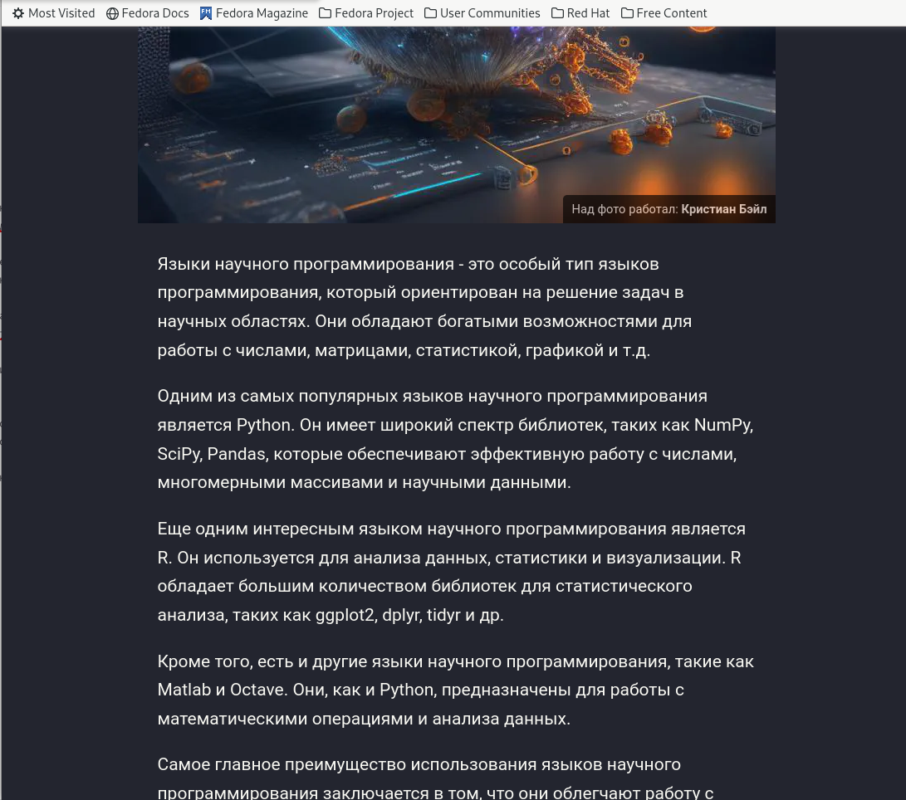{#fig:012 width=90%}

##

13. Перехожу в .../work/blog/content/post/this week , меняю изображение и открываю index.md. (рис. [-@fig:013])

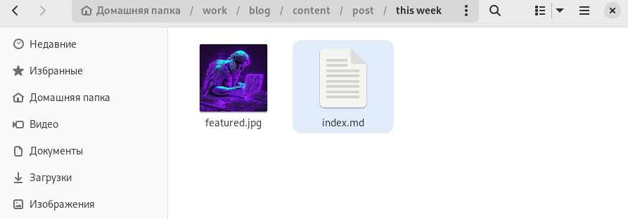{#fig:013 width=90%}

##

14. Пишу пост о прошедшей неделе. (рис. [-@fig:014])

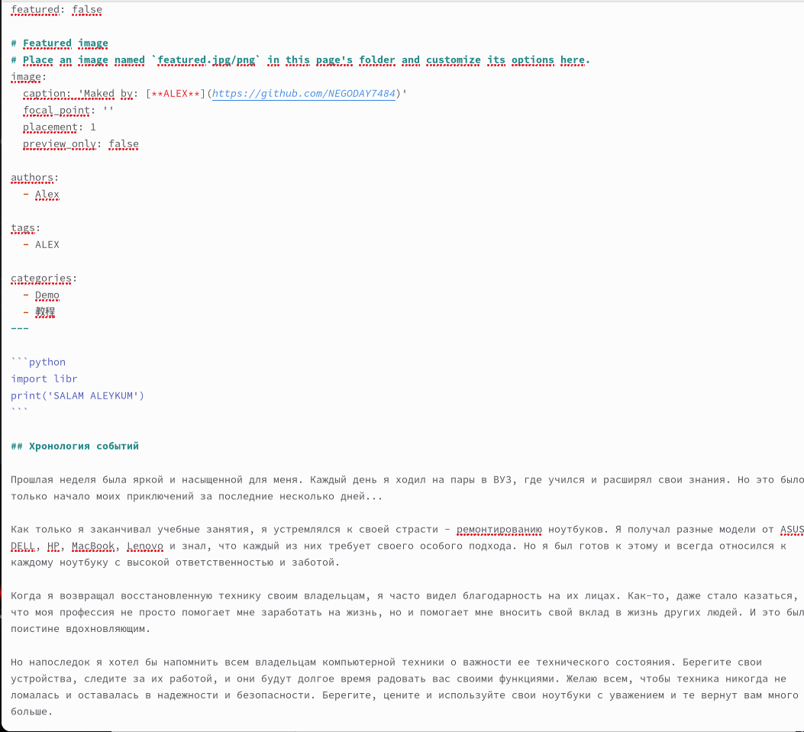{#fig:014 width=90%}

##

15. Проверяю изменения на локальном сайте. (рис. [-@fig:015])

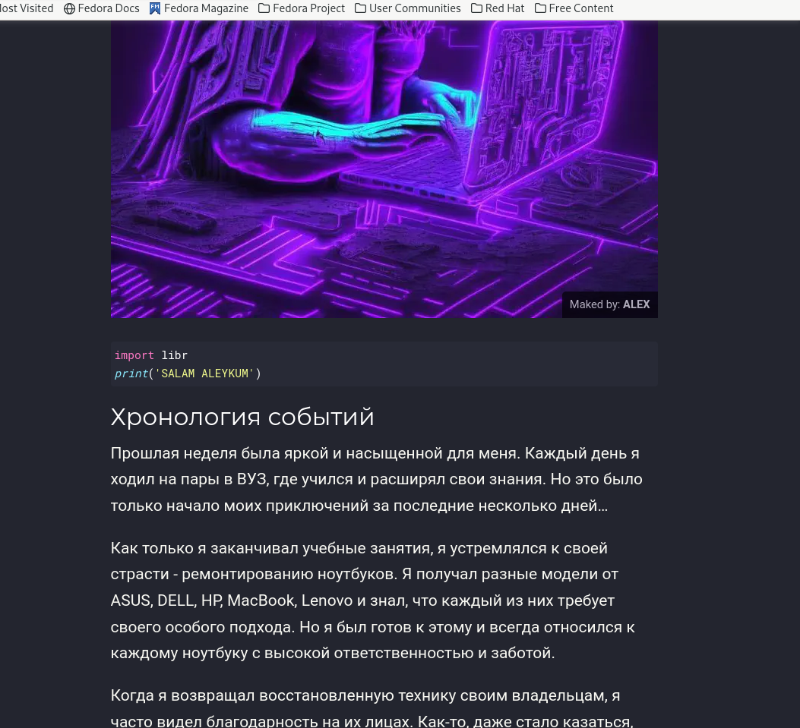{#fig:015 width=90%}

# Выводы

Я научился изменять информацию шаблона сайта github.io.

