---
## Front matter
title: "Пятый этап индивидуального проекта"
subtitle: "Наипростеший вариант выполнения"
author: "Атанесов Александр"

## Generic otions
lang: ru-RU
toc-title: "Содержание"

## Bibliography
bibliography: bib/cite.bib
csl: pandoc/csl/gost-r-7-0-5-2008-numeric.csl

## Pdf output format
toc: true # Table of contents
toc-depth: 2
lof: true # List of figures
lot: true # List of tables
fontsize: 12pt
linestretch: 1.5
papersize: a4
documentclass: scrreprt
## I18n polyglossia
polyglossia-lang:
  name: russian
  options:
	- spelling=modern
	- babelshorthands=true
polyglossia-otherlangs:
  name: english
## I18n babel
babel-lang: russian
babel-otherlangs: english
## Fonts
mainfont: PT Serif
romanfont: PT Serif
sansfont: PT Sans
monofont: PT Mono
mainfontoptions: Ligatures=TeX
romanfontoptions: Ligatures=TeX
sansfontoptions: Ligatures=TeX,Scale=MatchLowercase
monofontoptions: Scale=MatchLowercase,Scale=0.9
## Biblatex
biblatex: true
biblio-style: "gost-numeric"
biblatexoptions:
  - parentracker=true
  - backend=biber
  - hyperref=auto
  - language=auto
  - autolang=other*
  - citestyle=gost-numeric
## Pandoc-crossref LaTeX customization
figureTitle: "Рис."
tableTitle: "Таблица"
listingTitle: "Листинг"
lofTitle: "Список иллюстраций"
lotTitle: "Список таблиц"
lolTitle: "Листинги"
## Misc options
indent: true
header-includes:
  - \usepackage{indentfirst}
  - \usepackage{float} # keep figures where there are in the text
  - \floatplacement{figure}{H} # keep figures where there are in the text
---

# Цель работы

- Сделать записи для персональных проектов.
- Сделать пост по прошедшей неделе.
- Добавить пост на тему по выбору.
-  Языки научного программирования.
# Задание

Написать два поста :про прошлую неделю и про языки научного программирования.

# Выполнение пятого этапа индивидуального проекта

1. Запускаю hugo server в папке blog. (рис. [-@fig:001])

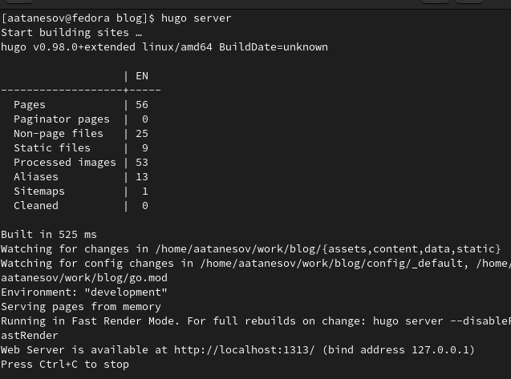{#fig:001 width=90%}

##

2. Открываю ссылку localhost. (рис. [-@fig:002])

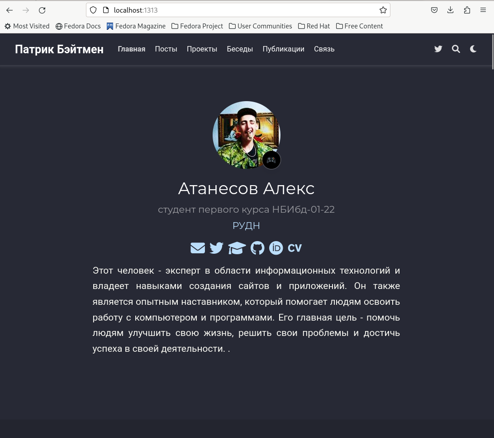{#fig:002 width=90%}

##

3. Верстаю страницу до нужного мне этапа Projects. (рис. [-@fig:003])

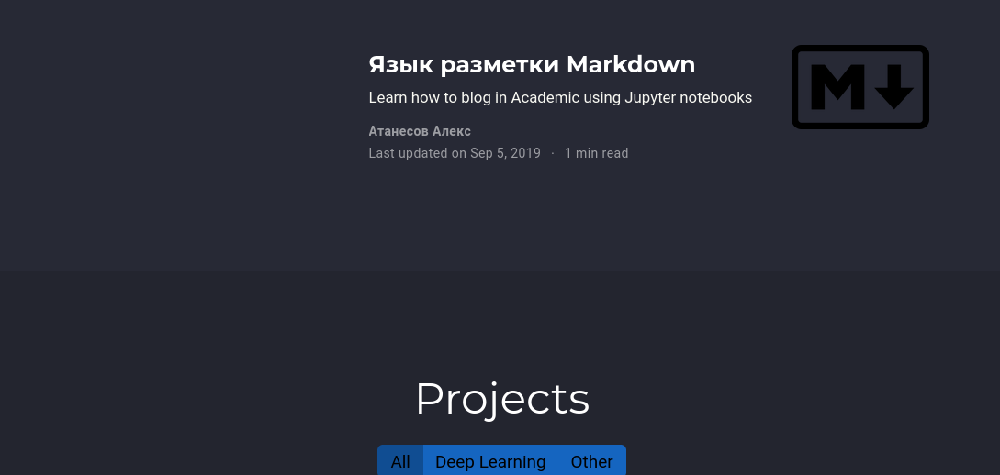{#fig:003 width=90%}

##

4. Перехожу в .../work/blog/content/project/example , меняю изображение и открываю index.md. (рис. [-@fig:004]) 

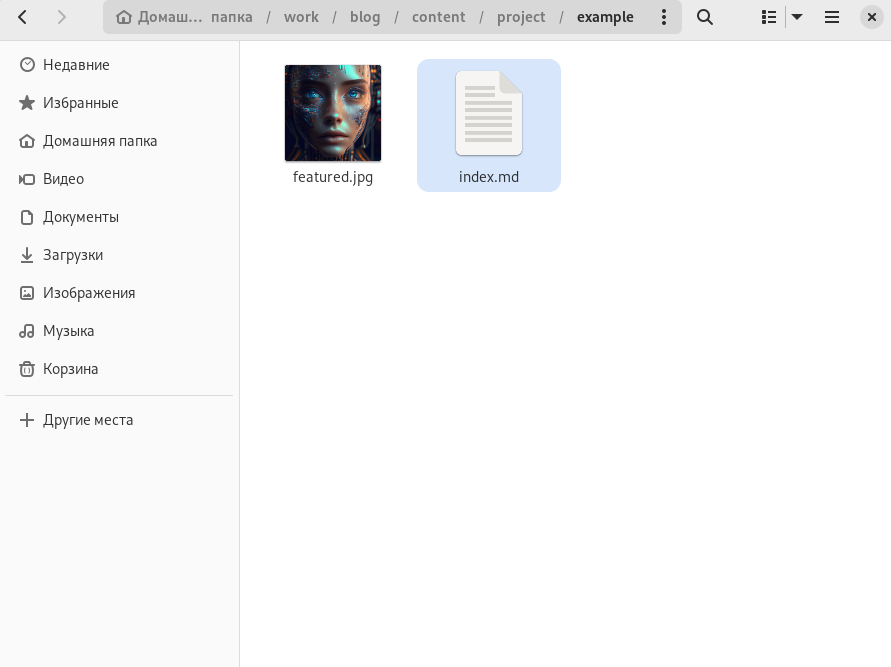{#fig:004 width=90%}

##

5. Пишу пост о проекте "Живое железо". (рис. [-@fig:005])

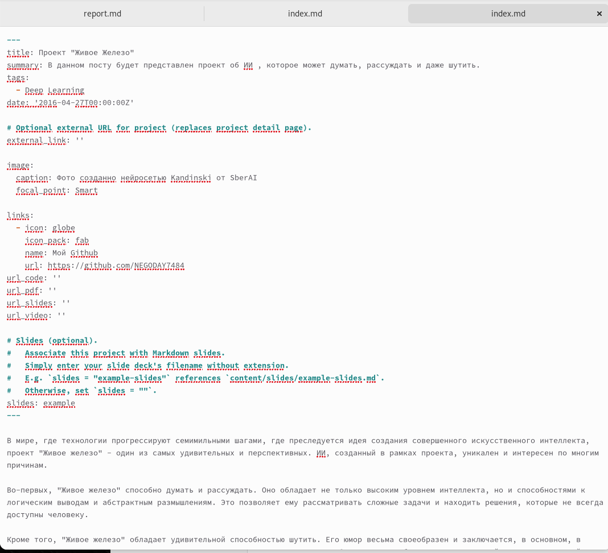{#fig:005 width=90%}

##

6. Проверяю изменения на локальном сайте. (рис. [-@fig:006])

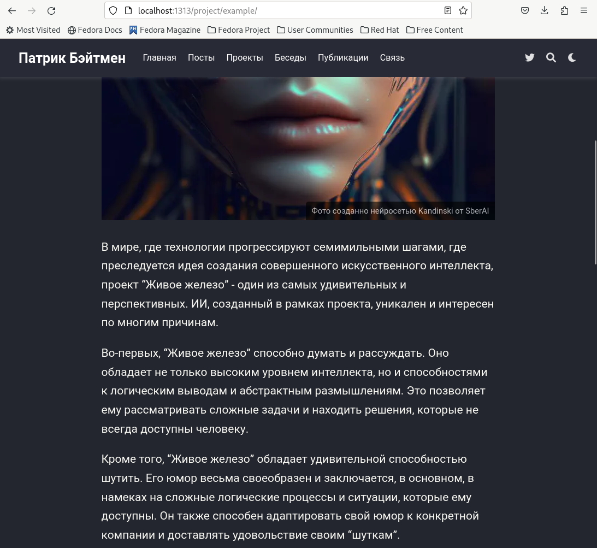{#fig:006 width=90%}

##

7. Перехожу в .../work/blog/content/project/Solar Roadways , меняю изображение и открываю index.md. (рис. [-@fig:007])

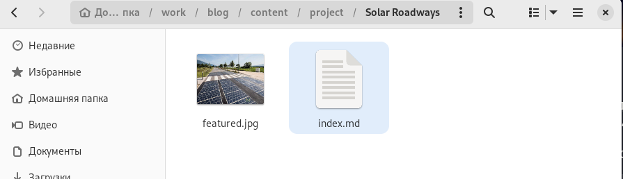{#fig:007 width=90%}

##

8.  Пишу пост о проекте "Солнечные дороги" . (рис. [-@fig:008])

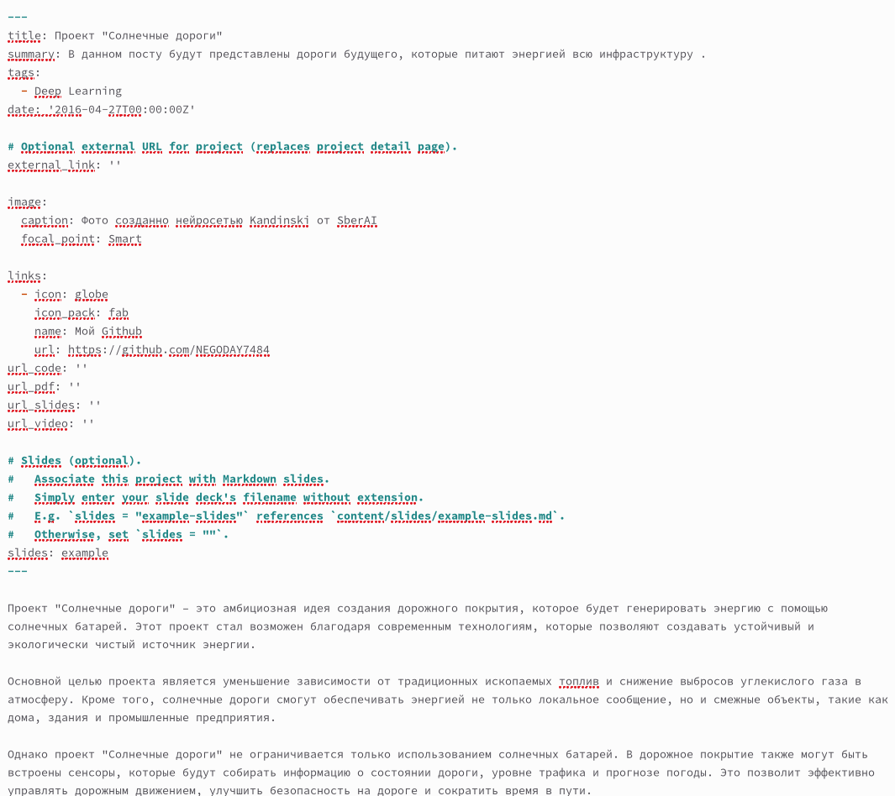{#fig:008 width=90%}

##

9.  Проверяю изменения на локальном сайте. (рис. [-@fig:009])

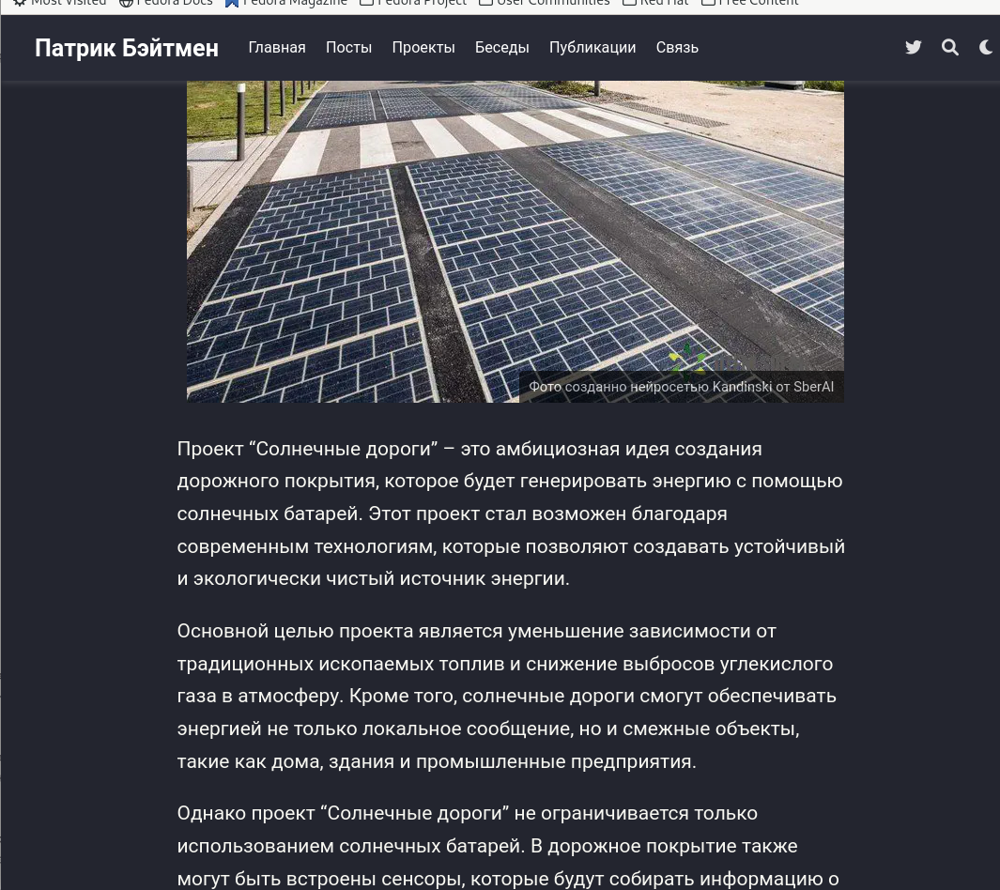{#fig:009 width=90%}

##

10. Перехожу в .../work/blog/content/post/The Science , меняю изображение и открываю index.md  . (рис. [-@fig:010])

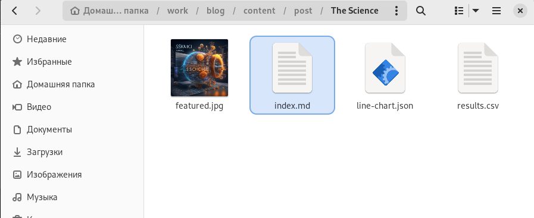{#fig:010 width=90%}

##

11. Открыв файл index.md и пишу пост о Языках Научного программирования. (рис. [-@fig:011])

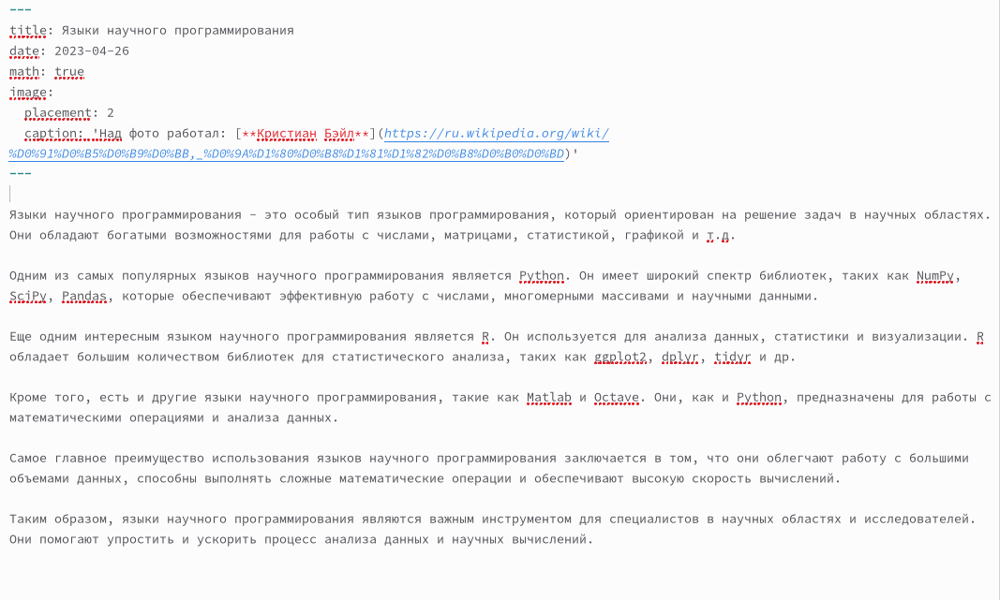{#fig:011 width=90%}

##

12.  Проверяю изменения на локальном сайте. (рис. [-@fig:012])

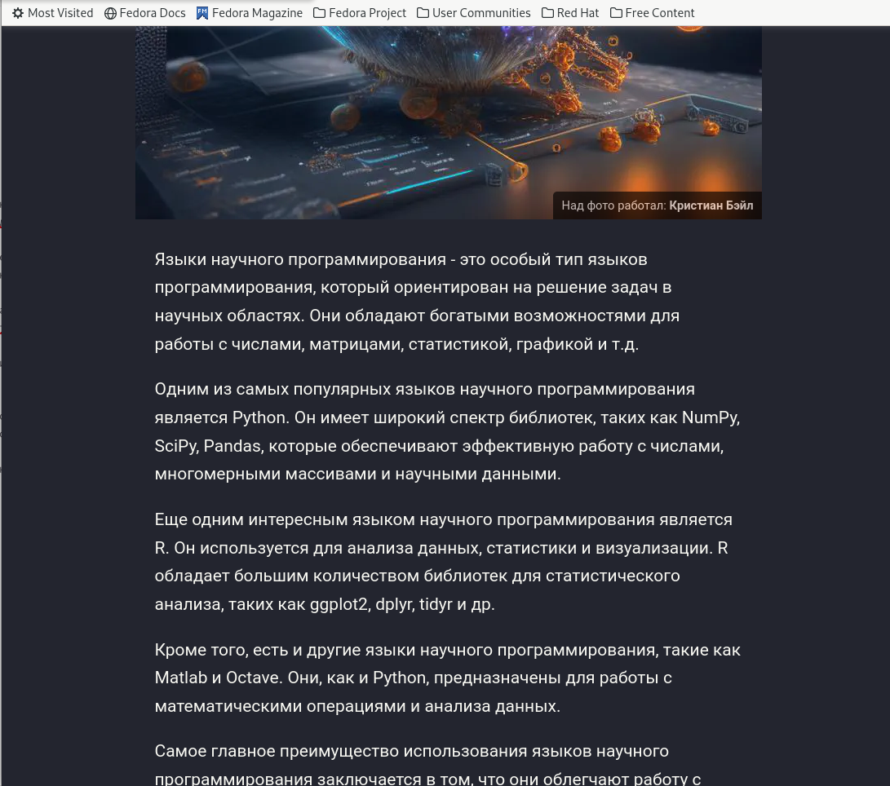{#fig:012 width=90%}

##

13. Перехожу в .../work/blog/content/post/this week , меняю изображение и открываю index.md. (рис. [-@fig:013])

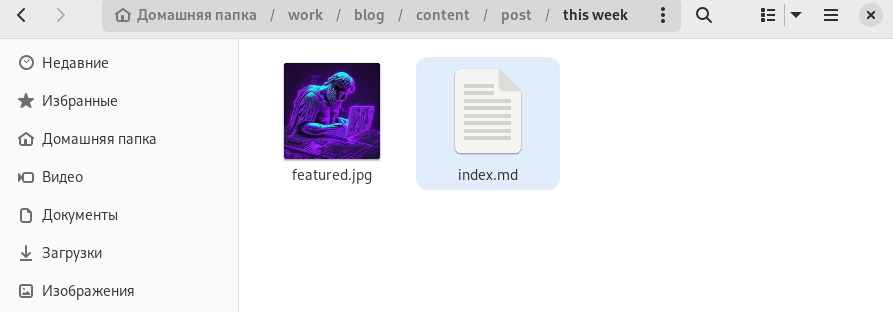{#fig:013 width=90%}

##

14. Пишу пост о прошедшей неделе. (рис. [-@fig:014])

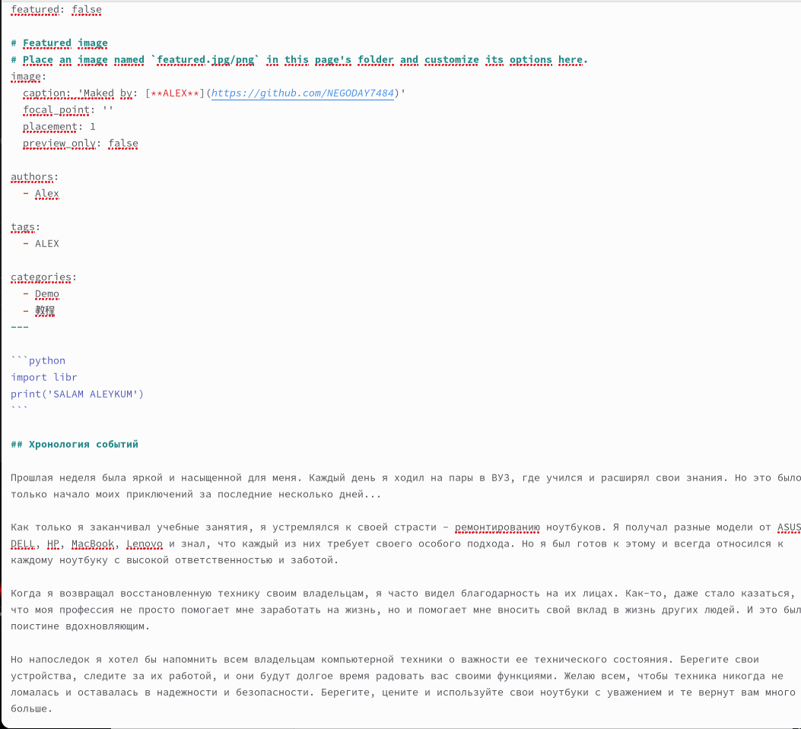{#fig:014 width=90%}

##

15. Проверяю изменения на локальном сайте. (рис. [-@fig:015])

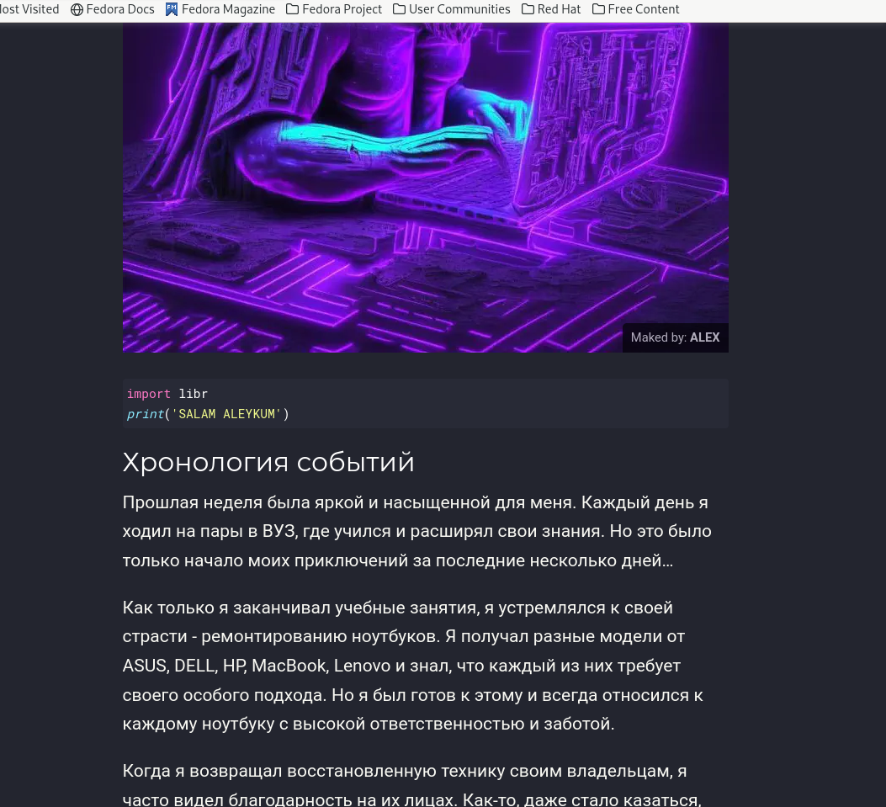{#fig:015 width=90%}

# Выводы

Я научился изменять информацию шаблона сайта github.io.

# Список литературы{.unnumbered}

::: {#refs}
:::
